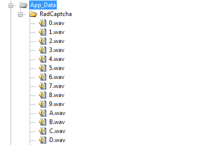
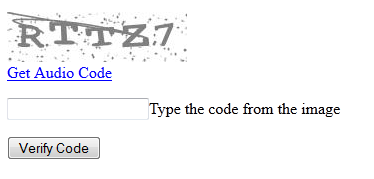

# Using Audio Code

In order for **RadCaptcha** to be accessible by visually impaired users, the control can generate an audio code. To enable this functionality you need to simply set the **CaptchaImage-EnableCaptchaAudio** property to true. This will cause a link button, that retrieves the audio code, to be rendered below the **CaptchaImage**. To control the visual appearance of the link button, the user should use the .**rcCaptchaAudioLink** CSS class.

Since the Q3 2013 release of Telerik® UI for ASP.NET AJAX, the RadCaptcha has an option for enabling a random background noise for the generated audio code in order to	improve the control's security. This functionality can be used by setting the property **CaptchaImage-EnableAudioNoise** to **true**.

## How the audio code is generated?

The **System.Speech.Synthesis** (available in .NET3.0+) namespace is used to "Speak" the randomly generated text code. Every character (alphanumeric only) is spelled using the [NATO phonetic alphabet](http://en.wikipedia.org/wiki/NATO_phonetic_alphabet). In order for the Captcha to be able to output an audio file the web application must be run in a full trust environment. Basically the application should run as a user account that has permissions to call the [SpeechSynthesizer.Speak(textToSpeak) method](http://msdn.microsoft.com/en-us/library/ms586901.aspx) on the server. Usually the user account does not have the needed permissions and the administrator has to grant them. For example in [IIS 6+ the Application Pools](http://www.microsoft.com/technet/prodtechnol/WindowsServer2003/Library/IIS/f05a7c2b-36b0-4b6e-ac7c-662700081f25.mspx?mfr=true) run as the ApplicationPoolIdentity built-in account (this is by default) which does not have enough permissions to call SpeechSynthesizer.Speak(textToSpeak). To be able to generate the code the Application Pools should have permissions as the LocalSystem built-in account.

In case the web application does not have enough permissions to "Speak" the text code or it uses .NET2.x (earlier than 3.0 versions of .NET Framework), the audio file will be generated by concatenation of ".wav" files that correspond to the specific character from the text code. By default RadCaptcha will look for the files in the **App_Data\RadCaptcha** directory, so you need to supply the folder and the files. You can copy the **App_Data\RadCaptcha** directory located in the **App_Data** folder of your **Telerik® UI for ASP.NET AJAX** installation. Please note that in order for the audio code to be generated correctly, there must be a ".wav" file for every possible character that can appear on the image and the file must be named as the character itself - "[Char]".wav (i.e. A.wav, B.wav, C.wav, 1.wav, 2.wav etc.).

A different location for the audio files can be used by setting the directory path to RadCaptcha's CaptchaImage - **AudioFilesPath** property. To make the control always generate the audio code by concatenating the ".wav" files set the **CaptchaImage-UseAudioFiles** property to **false**.

## Tutorial - How to configure RadCaptcha to generate audio code?

The following tutorial demonstrates how to configure RadCaptcha to generate audio code.

1. Follow the steps from the "[Getting Started]()" tutorial to create a web-site with RadCaptcha control.

1. In the Solution Explorer, right-click the project and select *Add | Add ASP.NET Folder | App_Data*.

1. Locate the **App_Data** folders in your Telerik® UI for ASP.NET AJAX installation.

1. Copy the **App_Data\RadCaptcha** to the project's **\App_Data** folder.

1. The project structure should now look like the screenshot below.

	

1. Enable the CaptchaAudio feature by setting the CaptchaImage - EnableCaptchaAudio property to true.

1. Press F5 to run the Application. RadCaptcha validates the input on a post back.

	

>note The ASP.NET application should be configured in [ASP.NET Full Trust level](http://msdn.microsoft.com/en-us/library/tkscy493%28v=vs.85%29.aspx) in order to use the captcha audio code regardless of whether the audio code is synthesized or it is generated by concatenating **.wav** files.

