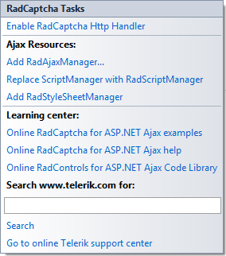

# Getting Started

The following tutorial demonstrates using **RadCaptcha** to validate page submission. The walk-through will also show how to display the Error Message in a ValidationSummary.

1. In the default page of a new ASP.NET AJAX-enabled Web Application add a **RadCaptcha** control, a Button control that causes post back on a click and a ValidationSummary control.

	

1. Open the **RadCaptcha** Smart Tag and select the Enable **RadCaptcha** httpHandler link. Click OK to close the confirmation dialog for the RadCaptcha handler.

	
	
	The httpHandler can be also enabled by placing the following lines in the web.config file:

	>caption web.config
	
	**XML**
	
		<configuration>
			<system.web>
				<httpHandlers>
					<add path="Telerik.Web.UI.WebResource.axd" type="Telerik.Web.UI.WebResource" verb="*" validate="false" /> 
				</httpHandlers>
			</system.web>
			<system.webServer>
				<handlers>
					<add name="Telerik_Web_UI_WebResource_axd" verb="*" preCondition="integratedMode" path="Telerik.Web.UI.WebResource.axd" type="Telerik.Web.UI.WebResource" /> 
				</handlers>
			</system.webServer>
		</configuration>

	>tip By default the image is stored in the Cache. However, if more than one server is used to host the page (web-farm environment) the Session should be used, because if the Cache is used the image is stored locally on the server. When Session is used, the HttpHandler definition (in the .config file) of the **RadCaptcha** should be modified manually by setting the type of the HttpHandler has to be set to **type="Telerik.Web.UI.WebResourceSession"** .
	
	>caption web.config
	
	**XML**
	
		<configuration>
			<system.web>
				<httpHandlers>
					<add path="Telerik.Web.UI.WebResource.axd" type="Telerik.Web.UI.WebResourceSession" verb="*" validate="false" />
				</httpHandlers>
			</system.web>
			<system.webServer>
				<handlers>
					<add name="Telerik_Web_UI_WebResource_axd" verb="*" preCondition="integratedMode" path="Telerik.Web.UI.WebResource.axd" type="Telerik.Web.UI.WebResourceSession" />
				</handlers>
			</system.webServer>
		</configuration>

1. In the Properties Window for the **RadCaptcha** control set the following properties:

	1. ErrorMessage = You have entered an invalid code.

	1. ValidationGroup = SubmitGroup

1. In the Properties Window for the ValidationSummary control set the ValidationGroup property to the same value as in RadCaptcha (ValidationGroup = SubmitGroup). Do the same for the Button control.

1. Press F5 to run the Application. **RadCaptcha** validates the input on a post back.
>caption 

