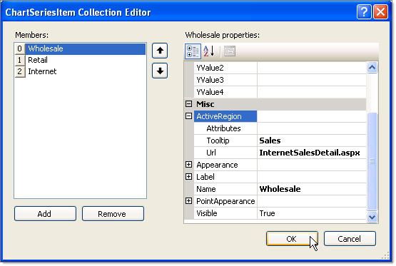
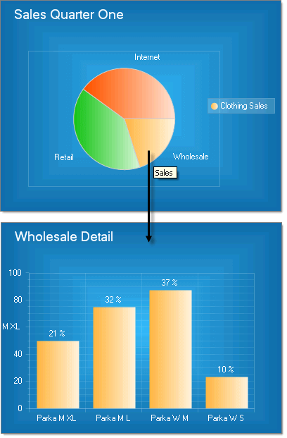

# Drill-Down

>caution  **RadChart** has been replaced by [RadHtmlChart](https://www.telerik.com/products/aspnet-ajax/html-chart.aspx), Telerik's client-side charting component. If you are considering **RadChart** for new development, examine the [RadHtmlChart documentation]() and [online demos](https://demos.telerik.com/aspnet-ajax/htmlchart/examples/overview/defaultcs.aspx) first to see if it will fit your development needs. If you are already using **RadChart** in your projects, you can migrate to **RadHtmlChart** by following these articles: [Migrating Series](), [Migrating Axes](), [Migrating Date Axes](), [Migrating Databinding](), [Features parity](). Support for **RadChart** is discontinued as of **Q3 2014**, but the control will remain in the assembly so it can still be used. We encourage you to use **RadHtmlChart** for new development.

The drill-down is a specialized [Image Map]() where the clicked area of the chart navigates to a view with greater detail. For example, the user may click on a series in the legend or a chart series item to reveal another chart with an expanded view of that series or series item. Drill downs are implemented using the ActiveRegion property (see [Image Map]() for more information on ActiveRegion).

In a simple drill-down example the chart series item for one area of a pie chart can be clicked on to navigate to another page in the project. The example has two pages, default.aspx and InternetSalesDetail.aspx.On Default.aspx a Pie chart displays percentage of sales for Wholesale, Retail and Internet divisions of a fictitious company.

Clicking on the Wholesale slice of the pie navigates to the InternetSalesDetail.aspx page.

>note In a more complex scenarios you will need to communicate between pages using query strings, Session variables or by filtering database data. Use a Click event handler for the chart or a Click event handler of a specific ActiveRegion to setup the data selection for the detail web page before navigating to it.

# See Also

 * [Image Maps]()
