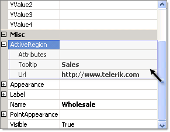

# Image Maps

>caution  **RadChart** has been replaced by [RadHtmlChart](http://www.telerik.com/products/aspnet-ajax/html-chart.aspx), Telerik's client-side charting component. If you are considering **RadChart** for new development, examine the [RadHtmlChart documentation]() and [online demos](http://demos.telerik.com/aspnet-ajax/htmlchart/examples/overview/defaultcs.aspx) first to see if it will fit your development needs. If you are already using **RadChart** in your projects, you can migrate to **RadHtmlChart** by following these articles: [Migrating Series](), [Migrating Axes](), [Migrating Date Axes](), [Migrating Databinding](), [Features parity](). Support for **RadChart** is discontinued as of **Q3 2014**, but the control will remain in the assembly so it can still be used. We encourage you to use **RadHtmlChart** for new development.

Image maps are visual areas within the chart that display tool tips and can be clicked on to navigate. Image map areas are represented by the ActiveRegion property.ActiveRegion appears for many of the UI elements in the chart including labels, chart series, chart series items, chart title, legend, axis items and the empty series message. Image maps can be used to implement [Drill-Down]() user interfaces.

The ActiveRegion property has three significant properties:

* Attributes: Enter HTML attributes here. The most common use of this property is to specify the Target attribute.Target may be specified as **_blank** (target URL will open in a new window), **_self** (target URL will open in the same frame), **_parent** (target URL will open in the parent frameset) and **_top** (target URL will open in the topmost frame).

* ToolTip: A text description of an area in the image map that displays when the mouse hovers over it.

* Url: The address of a web page in the project or an external web site. When an area in the image map is clicked, the page navigates to the address in the Url.

The ActiveRegion property has server side methods:

GotoURL: Navigates to the address specified in Url.

CheckPoint: Checks if a point lies inside a region.

The ActiveRegion property also responds to the Click event.

## Create an Image Map

To create an image map, locate an ActiveRegion property for the area of the chart you are interested in. In the Url property specify a page within your web project or an external web address. In the ToolTip enter descriptive text that lets the user know what will happen if they click that area of the chart. You may specify Attributes if you need the user to navigate to other than the current web page.

Below is the ActiveRegion for a [chart series item](). If the mouse hovers over that area in the chart the tool tip "Sales" will display. If the area is clicked, the Telerik web site will display in the same frame (the default target behavior).



>tip The **ActiveRegion** resolves to a standard HTML "map" tag that defines the area within the chart image that will respond to the mouse.

````XML
<map id='imRadChart1' name='imRadChart1'><areashape="poly" href="[http://www.telerik.com](http://www.telerik.com)" coords="176,168,247,167,248,199,227,226,198,236" alt="Sales" title="Sales" /></map>
````

# See Also

 * [Drill-Down]()

 