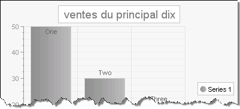

# Localization Example Using Global Resources, Explicit Expression

>caution  **RadChart** has been replaced by[RadHtmlChart](http://www.telerik.com/products/aspnet-ajax/html-chart.aspx), Telerik's client-side charting component.	If you are considering **RadChart** for new development, examine the[RadHtmlChart documentation](ffd58685-7423-4c50-9554-f92c70a75138)and[online demos](http://demos.telerik.com/aspnet-ajax/htmlchart/examples/overview/defaultcs.aspx)first to see if it will fit your development needs.	If you are already using **RadChart** in your projects, you can migrate to **RadHtmlChart** by following these articles:[Migrating Series](2f393f28-bc31-459c-92aa-c3599785f6cc),[Migrating Axes](3f1bea81-87b9-4324-b0d2-d13131031048),[Migrating Date Axes](93226130-bc3c-4c53-862a-f9e17b2eb7dd),[Migrating Databinding](d6c5e2f1-280c-4fb0-b5b0-2f507697511d),[Feature parity](010dc716-ce38-480b-9157-572e0f140169).	Support for **RadChart** is discontinued as of **Q3 2014** , but the control will remain in the assembly so it can still be used.	We encourage you to use **RadHtmlChart** for new development.

This tutorial will demonstrate localizing the RadChart title using a global resource and binding it to the title with an explicit expression. See [Multi-Language Support for RadChart]() for an overview of localization options.

1. Create a simple ASP.NET AJAX enabled RadChart application. See Quick Start: [Create a Bar Chart with Simple Static Data]() for an example. The following steps assume the web page is named "default.aspx".

1. Paste the following ASP.NET HTML definition of the chart:

	**ASP.NET**

		<telerik:RadChart ID="RadChart1" runat="server">
		<PlotArea>
		   <XAxis MaxValue="3" MinValue="1" Step="1"></XAxis>
		   <YAxis MaxValue="50"></YAxis>
		</PlotArea>
		<ChartTitle><TextBlock Text="Sales"></TextBlock></ChartTitle>
		<Series>
		   <radC:ChartSeries Name="Series 1">
			   <items>
					   <radC:ChartSeriesItem YValue="50">
						   <Label><TextBlock Text="One"></TextBlock></Label>
					   </radC:ChartSeriesItem>
					   <radC:ChartSeriesItem YValue="30">
						   <Label><TextBlock Text="Two"></TextBlock></Label>
					   </radC:ChartSeriesItem>
					   <radC:ChartSeriesItem YValue="20">
						   <Label><TextBlock Text="Three"></TextBlock></Label>
					   </radC:ChartSeriesItem>
				   </items>
		   </radC:ChartSeries>
		</Series>
		</telerik:RadChart> 	

1. In the Solution Explorer, right-click the project and select **Add** | **Add ASP.NET Folder** | **App_GlobalResources** from the context menu.

1. Right-click **App_GlobalResources** and click **Add** | **New Item**| **Resource File** from the context menu.Name the resource MyGlobals.resx.

1. In the Solution Explorer, double-click MyGlobals.resx and add an entry named "Title" with value "Top Ten Sales".

1. In the Solution Explorer, copy MyGlobals.resx to MyGlobals.fr-FR.resx.

1. In the Solution Explorer, double-click MyGlobals.fr-FR.resx and add the entry named "Title" with value "Ventes du principal dix".

1. In the ASP.NET HTML markup for the page add the explicit expression "<%$ Resources:MyGlobals, Title %>" to the **Text**attribute for the chart title. The ASP.NET HTML markup for the chart title should now look like this:

	**ASP.NET**
	
		<ChartTitle>
		   <TextBlock Text="<$ Resources>">
		   </TextBlock>
		</ChartTitle> 

1. Run the application. The chart title should still be "Top Ten Sales".

1. In the web browser (we will assume Internet Explorer for this example), select **Tools** | **Internet Options** | **Languages**.

1. In the **Language Preference** dialog click the **Add** button.

1. Locate the France "fr-FR" culture code and click **OK.**

1. If there are other languages in the **Language Preference** dialog list, use the arrow keys to place "fr-FR" at the top of the list.

1. Click the **OK** button to close the **Language Preference** dialog.

1. Click **OK** to close the **Internet Options** dialog.

1. Refresh the browser page.The title should now be localized to "Ventes du principal dix".

