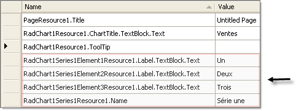

# Localization Example Using Local Resources, Implicit Expression


>caution  **RadChart** has been replaced by[RadHtmlChart](http://www.telerik.com/products/aspnet-ajax/html-chart.aspx), Telerik's client-side charting component.	If you are considering **RadChart** for new development, examine the[RadHtmlChart documentation](ffd58685-7423-4c50-9554-f92c70a75138)and[online demos](http://demos.telerik.com/aspnet-ajax/htmlchart/examples/overview/defaultcs.aspx)first to see if it will fit your development needs.	If you are already using **RadChart** in your projects, you can migrate to **RadHtmlChart** by following these articles:[Migrating Series](2f393f28-bc31-459c-92aa-c3599785f6cc),[Migrating Axes](3f1bea81-87b9-4324-b0d2-d13131031048),[Migrating Date Axes](93226130-bc3c-4c53-862a-f9e17b2eb7dd),[Migrating Databinding](d6c5e2f1-280c-4fb0-b5b0-2f507697511d),[Feature parity](010dc716-ce38-480b-9157-572e0f140169).	Support for **RadChart** is discontinued as of **Q3 2014** , but the control will remain in the assembly so it can still be used.	We encourage you to use **RadHtmlChart** for new development.
>


## 

This tutorial will demonstrate localizing the RadChart title, series name and chart series item labels. The example will use local resources and use implicit expressions to bind them. See [Multi-Language Support for RadChart]() for an overview of localization options.

1. Create a simple ASP.NET AJAX enabled RadChart application. See Quick Start: [Create a Bar Chart with Simple Static Data]() for an example. The following steps assume the web page is named "default.aspx".

1. Paste the following ASP.NET HTML definition of the chart:

````ASPNET
	<telerik:radchart id="RadChart1" runat="server">
	   <PlotArea>
	       <XAxis MaxValue="3" MinValue="1" Step="1"></XAxis>
	       <YAxis MaxValue="50"></YAxis>
	   </PlotArea>
	   <ChartTitle><TextBlock Text="Sales"></TextBlock></ChartTitle>
	   <Series>
	       <radC:ChartSeries Name="Series 1">
	           <items>
	                   <radC:ChartSeriesItem YValue="50">
	                       <Label><TextBlock Text="One"></TextBlock></Label>
	                   </radC:ChartSeriesItem>
	                   <radC:ChartSeriesItem YValue="30">
	                       <Label><TextBlock Text="Two"></TextBlock></Label>
	                   </radC:ChartSeriesItem>
	                   <radC:ChartSeriesItem YValue="20">
	                       <Label><TextBlock Text="Three"></TextBlock></Label>
	                   </radC:ChartSeriesItem>
	               </items>
	       </radC:ChartSeries>
	   </Series>
	</telerik:radchart>
````


1. In design mode of the Visual Studio 2005 IDE select the menu Tools | Generate Local Resource. Notice that in the Solution Explorer a new "App_LocalResources" folder is created and populated with a resource file named default.aspx.resx.

1. Double click default.aspx.resx.

1. Add a new entry named "RadChart1Resource1.ChartTitle.TextBlock.Text" with value "Top Sales". Some entries may already exist for the page title and chart tool tip.
>caption 


1. Add the resource key "meta:resourcekey="RadChart1Resource1"" to the ASP.NET HTML markup for the chart. The RadChart tag should now look like the example below:

````ASPNET
	    <telerik:radchart id="RadChart1" runat="server" enableembeddedskins="False" meta:resourcekey="RadChart1Resource1">		
````


1. In the Solution Explorer, copy "Default.aspx.resx" and name it using the culture code for French, "Default.aspx.fr-FR.resx".

1. Double click "Default.aspx.fr-FR.resx".

1. Enter "Ventes" for the "RadChart1Resource1.ChartTitle.TextBlock.Text" resource name.
>caption 


1. Run the application. The chart title should still be "Sales".

1. In the web browser (we will assume Internet Explorer for this example), select Tools | Internet Options | Languages.

1. In the **Language Preference** dialog click the **Add** button.

1. Locate the France "fr-FR" culture code and click **OK.**

1. If there are other languages in the **Language Preference** dialog list, use the arrow keys to place "fr-FR" at the top of the list.

1. Click the **OK** button to close the **Language Preference** dialog.

1. Click **OK** to close the **Internet Options** dialog.

1. Refresh the browser page.The title should now be localized to "Ventes".
>caption 


1. Stop the application.

1. Now that the chart title is localized we turn to the series name and item labels.Add another resource key to the ASP.NET HTML markup for the ChartSeries tag "meta:resourcekey="RadChart1Series1Resource1"". The ChartSeries tag will now look like the example below:

````ASPNET
	     
	<Series>
	   <radC:ChartSeries Name="Series 1" meta:resourcekey="RadChart1Series1Resource1">
	. . . 
				
````


1. To each item tag in the ASP.NET HTML markup add another resource key "meta:resourceKey="RadChart1Series1Element1Resource1">".Name the resource keys "RadChart1Series1Element**1**Resource1", "RadChart1Series1Element**2**Resource1" and "RadChart1Series1Element**3**Resource1" respectively. You will need to add these resource keys for each tag in the HTML that has its own name space.For example, each of the ChartSeriesItem tags is prefixed with the "radC" prefix. The markup should now look like the example below:

````ASPNET
	
	<items>
	   <radC:ChartSeriesItem YValue="50"
	       meta:resourceKey="RadChart1Series1Element1Resource1">
	       <Label><TextBlock Text="One"></TextBlock></Label>
	   </radC:ChartSeriesItem>
	   <radC:ChartSeriesItem YValue="30"
	       meta:resourceKey="RadChart1Series1Element2Resource1">
	       <Label><TextBlock Text="Two"></TextBlock></Label>
	   </radC:ChartSeriesItem>
	   <radC:ChartSeriesItem YValue="20"
	       meta:resourceKey="RadChart1Series1Element3Resource1">
	       <Label><TextBlock Text="Three"></TextBlock></Label>
	   </radC:ChartSeriesItem>
	</items>      
	
````


1. In the Default.aspx.resx file add the keys and values highlighted in the screen shot below.Notice how the the first part of each name corresponds to the resource key name in the ASP.NET HTML markup followed by the property name.
>caption 


1. Copy these items to the Default.aspx.fr-FR.resx file and provide the translated values as shown in the screen shot below.You can delete the old entries and copy and paste from default.aspx.resx.
>caption 



>caution If you copy and paste, the designer may rename resource entries by appending a number.You may need to rename these back so they match the values of the other resource file.
>


1. Run the application. The chart title, series and item labels should all display translated values. The screen shot below shows the appearance of the completed chart.Note: a skin has been applied to the chart to make the values easily visible:
>caption 


