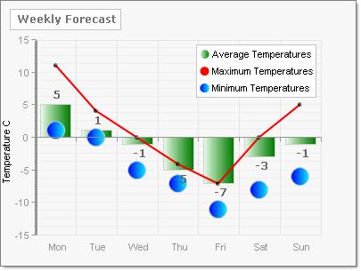

# Multiple Chart Types in a Single Chart

>caution  **RadChart** has been replaced by [RadHtmlChart](http://www.telerik.com/products/aspnet-ajax/html-chart.aspx), Telerik's client-side charting component. If you are considering **RadChart** for new development, examine the [RadHtmlChart documentation]() and [online demos](http://demos.telerik.com/aspnet-ajax/htmlchart/examples/overview/defaultcs.aspx) first to see if it will fit your development needs. If you are already using **RadChart** in your projects, you can migrate to **RadHtmlChart** by following these articles: [Migrating Series](), [Migrating Axes](), [Migrating Date Axes](), [Migrating Databinding](), [Features parity](). Support for **RadChart** is discontinued as of **Q3 2014**, but the control will remain in the assembly so it can still be used. We encourage you to use **RadHtmlChart** for new development.

RadChart allows you to combine several [chart types]() in a single chart. You can use the ChartSeries Collection Editor at design-time to create the ChartSeries and set the respective ChartSeriesType. You can also add chart series and set chart type programmatically.

To designate dissimilar [chart types]() in a single chart at design time, click on a series, then select the **Type** property from the drop down list.


To assign chart types to a series at run-time programmatically you can pass the ChartSeriesType in the constructor or assign the ChartSeriesType after the series is constructed.The example below passes three chart series types to the constructor.

````C#   
ChartSeries chartSeries =
 new ChartSeries("Average Temperatures", ChartSeriesType.Bar);
ChartSeries chartSeries2 =
 new ChartSeries("Maximum Temperatures", ChartSeriesType.Line);
ChartSeries chartSeries3 =
 new ChartSeries("Minimum Temperatures", ChartSeriesType.Bubble);			
````
````VB	
Dim chartSeries As New ChartSeries("Average Temperatures", ChartSeriesType.Bar)
Dim chartSeries2 As New ChartSeries("Maximum Temperatures", ChartSeriesType.Line)
Dim chartSeries3 As New ChartSeries("Minimum Temperatures", ChartSeriesType.Bubble)
````

Use the Axis.Range property to set minimum values, maximum values and step amount for each axis.  The screen shot below shows three chart series types in the same chart. See below for the full source.



````C#   
RadChart radChart = new RadChart();
radChart.PlotArea.Appearance.Dimensions.Margins.Right =
Telerik.Charting.Styles.Unit.Percentage(10);
radChart.Legend.Appearance.Position.Auto = false;
radChart.Legend.Appearance.Position.X = 220;
radChart.Legend.Appearance.Position.Y = 50;
radChart.ChartTitle.Appearance.Position.AlignedPosition =
Telerik.Charting.Styles.AlignedPositions.TopLeft;
radChart.ChartTitle.TextBlock.Text = "Weekly Forecast";
radChart.ChartTitle.TextBlock.Appearance.TextProperties.Font =
new System.Drawing.Font("Verdana", 9, System.Drawing.FontStyle.Bold);
radChart.PlotArea.XAxis.AutoScale = false;
radChart.PlotArea.XAxis.AddRange(1, 7, 1);
radChart.PlotArea.XAxis[0].TextBlock.Text = "Mon";
radChart.PlotArea.XAxis[1].TextBlock.Text = "Tue";
radChart.PlotArea.XAxis[2].TextBlock.Text = "Wed";
radChart.PlotArea.XAxis[3].TextBlock.Text = "Thu";
radChart.PlotArea.XAxis[4].TextBlock.Text = "Fri";
radChart.PlotArea.XAxis[5].TextBlock.Text = "Sat";
radChart.PlotArea.XAxis[6].TextBlock.Text = "Sun";
radChart.PlotArea.XAxis.IsZeroBased = false;
radChart.PlotArea.YAxis.AxisMode = ChartYAxisMode.Extended;
radChart.PlotArea.YAxis.AxisLabel.TextBlock.Text = "Temperature C";
radChart.PlotArea.YAxis.Appearance.Width = 3;
// Create the series and assign the ChartSeriesType
ChartSeries chartSeries =
new ChartSeries("Average Temperatures", ChartSeriesType.Bar);
chartSeries.Appearance.TextAppearance.TextProperties.Font =
new System.Drawing.Font("Verdana", 9, System.Drawing.FontStyle.Bold);
chartSeries.Appearance.FillStyle.MainColor =
System.Drawing.Color.Honeydew;
chartSeries.Appearance.FillStyle.SecondColor =
System.Drawing.Color.Green;
// Define the items in the series
chartSeries.AddItem(5);
chartSeries.AddItem(1);
chartSeries.AddItem(-1);
chartSeries.AddItem(-5);
chartSeries.AddItem(-7);
chartSeries.AddItem(-3);
chartSeries.AddItem(-1);
// Create the series and assign the ChartSeriesType
ChartSeries chartSeries2 =
new ChartSeries("Maximum Temperatures", ChartSeriesType.Line);
chartSeries2.Appearance.LabelAppearance.Visible = false;
chartSeries2.Appearance.LineSeriesAppearance.Color =
System.Drawing.Color.Red;
// Define the items in the series
chartSeries2.AddItem(11);
chartSeries2.AddItem(4);
chartSeries2.AddItem(0);
chartSeries2.AddItem(-4);
chartSeries2.AddItem(-7);
chartSeries2.AddItem(0);
chartSeries2.AddItem(5);
// visually enhance the data points
chartSeries2.Appearance.PointMark.Dimensions.Width = 5;
chartSeries2.Appearance.PointMark.Dimensions.Height = 5;
chartSeries2.Appearance.PointMark.FillStyle.MainColor =
System.Drawing.Color.Black;
chartSeries2.Appearance.PointMark.Visible = true;
// Create the series and assign the ChartSeriesType
ChartSeries chartSeries3 =
new ChartSeries("Minimum Temperatures", ChartSeriesType.Bubble);
chartSeries3.Appearance.LabelAppearance.Visible = false;
chartSeries3.Appearance.FillStyle.MainColor = System.Drawing.Color.Blue;
chartSeries3.Appearance.FillStyle.SecondColor = System.Drawing.Color.Aqua;
// Define the items in the series
chartSeries3.AddItem(1);
chartSeries3.AddItem(0);
chartSeries3.AddItem(-5);
chartSeries3.AddItem(-7);
chartSeries3.AddItem(-11);
chartSeries3.AddItem(-8);
chartSeries3.AddItem(-6);
// visually enhance the data points
chartSeries3.Appearance.PointMark.Dimensions.Width = 5;
chartSeries3.Appearance.PointMark.Dimensions.Height = 5;
chartSeries3.Appearance.PointMark.FillStyle.MainColor =
System.Drawing.Color.Black;
chartSeries3.Appearance.PointMark.Visible = true;
// Add the series to the chart, chart to page.
radChart.Series.Add(chartSeries);
radChart.Series.Add(chartSeries2);
radChart.Series.Add(chartSeries3);
this.Page.Controls.Add(radChart);			
````
````VB	     
Dim radChart As New RadChart()
radChart.PlotArea.Appearance.Dimensions.Margins.Right = Telerik.Charting.Styles.Unit.Percentage(10)
radChart.Legend.Appearance.Position.Auto = False
radChart.Legend.Appearance.Position.X = 220
radChart.Legend.Appearance.Position.Y = 50
radChart.ChartTitle.Appearance.Position.AlignedPosition = Telerik.Charting.Styles.AlignedPositions.TopLeft
radChart.ChartTitle.TextBlock.Text = "Weekly Forecast"
radChart.ChartTitle.TextBlock.Appearance.TextProperties.Font = New System.Drawing.Font("Verdana", 9, System.Drawing.FontStyle.Bold)
radChart.PlotArea.XAxis.AutoScale = False
radChart.PlotArea.XAxis.AddRange(1, 7, 1)
radChart.PlotArea.XAxis(0).TextBlock.Text = "Mon"
radChart.PlotArea.XAxis(1).TextBlock.Text = "Tue"
radChart.PlotArea.XAxis(2).TextBlock.Text = "Wed"
radChart.PlotArea.XAxis(3).TextBlock.Text = "Thu"
radChart.PlotArea.XAxis(4).TextBlock.Text = "Fri"
radChart.PlotArea.XAxis(5).TextBlock.Text = "Sat"
radChart.PlotArea.XAxis(6).TextBlock.Text = "Sun"
radChart.PlotArea.XAxis.IsZeroBased = False
radChart.PlotArea.YAxis.AxisMode = ChartYAxisMode.Extended
radChart.PlotArea.YAxis.AxisLabel.TextBlock.Text = "Temperature C"
radChart.PlotArea.YAxis.Appearance.Width = 3
' Create the series and assign the ChartSeriesType
Dim chartSeries As New ChartSeries("Average Temperatures", ChartSeriesType.Bar)
chartSeries.Appearance.TextAppearance.TextProperties.Font = New System.Drawing.Font("Verdana", 9, System.Drawing.FontStyle.Bold)
chartSeries.Appearance.FillStyle.MainColor = System.Drawing.Color.Honeydew
chartSeries.Appearance.FillStyle.SecondColor = System.Drawing.Color.Green
' Define the items in the series
chartSeries.AddItem(5)
chartSeries.AddItem(1)
chartSeries.AddItem(-1)
chartSeries.AddItem(-5)
chartSeries.AddItem(-7)
chartSeries.AddItem(-3)
chartSeries.AddItem(-1)
' Create the series and assign the ChartSeriesType
Dim chartSeries2 As New ChartSeries("Maximum Temperatures", ChartSeriesType.Line)
chartSeries2.Appearance.LabelAppearance.Visible = False
chartSeries2.Appearance.LineSeriesAppearance.Color = System.Drawing.Color.Red
' Define the items in the series
chartSeries2.AddItem(11)
chartSeries2.AddItem(4)
chartSeries2.AddItem(0)
chartSeries2.AddItem(-4)
chartSeries2.AddItem(-7)
chartSeries2.AddItem(0)
chartSeries2.AddItem(5)
' visually enhance the data points
chartSeries2.Appearance.PointMark.Dimensions.Width = 5
chartSeries2.Appearance.PointMark.Dimensions.Height = 5
chartSeries2.Appearance.PointMark.FillStyle.MainColor = System.Drawing.Color.Black
chartSeries2.Appearance.PointMark.Visible = True
' Create the series and assign the ChartSeriesType
Dim chartSeries3 As New ChartSeries("Minimum Temperatures", ChartSeriesType.Bubble)
chartSeries3.Appearance.LabelAppearance.Visible = False
chartSeries3.Appearance.FillStyle.MainColor = System.Drawing.Color.Blue
chartSeries3.Appearance.FillStyle.SecondColor = System.Drawing.Color.Aqua
' Define the items in the series
chartSeries3.AddItem(1)
chartSeries3.AddItem(0)
chartSeries3.AddItem(-5)
chartSeries3.AddItem(-7)
chartSeries3.AddItem(-11)
chartSeries3.AddItem(-8)
chartSeries3.AddItem(-6)
' visually enhance the data points
chartSeries3.Appearance.PointMark.Dimensions.Width = 5
chartSeries3.Appearance.PointMark.Dimensions.Height = 5
chartSeries3.Appearance.PointMark.FillStyle.MainColor = System.Drawing.Color.Black
chartSeries3.Appearance.PointMark.Visible = True
' Add the series to the chart, chart to page.
radChart.Series.Add(chartSeries)
radChart.Series.Add(chartSeries2)
radChart.Series.Add(chartSeries3)
Me.Page.Controls.Add(radChart) 				
````

