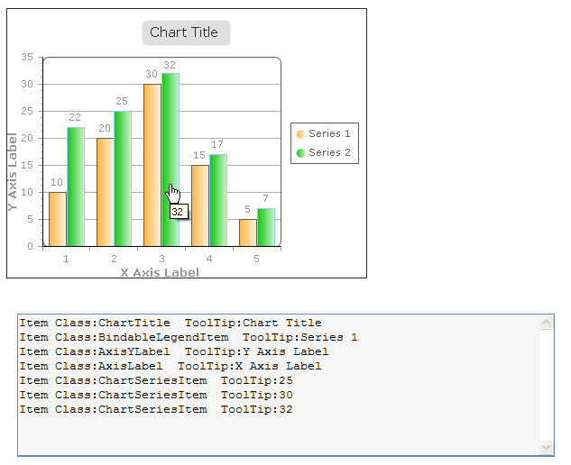
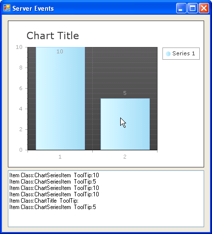

# Responding to Server Events


>caution  __RadChart__ has been replaced by[RadHtmlChart](http://www.telerik.com/products/aspnet-ajax/html-chart.aspx), Telerik's client-side charting component.	If you are considering __RadChart__ for new development, examine the[RadHtmlChart documentation](ffd58685-7423-4c50-9554-f92c70a75138)and[online demos](http://demos.telerik.com/aspnet-ajax/htmlchart/examples/overview/defaultcs.aspx)first to see if it will fit your development needs.	If you are already using __RadChart__ in your projects, you can migrate to __RadHtmlChart__ by following these articles:[Migrating Series](2f393f28-bc31-459c-92aa-c3599785f6cc),[Migrating Axes](3f1bea81-87b9-4324-b0d2-d13131031048),[Migrating Date Axes](93226130-bc3c-4c53-862a-f9e17b2eb7dd),[Migrating Databinding](d6c5e2f1-280c-4fb0-b5b0-2f507697511d),[Feature parity](010dc716-ce38-480b-9157-572e0f140169).	Support for __RadChart__ is discontinued as of __Q3 2014__ , but the control will remain in the assembly so it can still be used.	We encourage you to use __RadHtmlChart__ for new development.
>


## 

Use the __RadChart____OnClick__ event to handle server postbacks caused by clicking on areas of the chart. Elements of the chart that have an ActiveRegion property can be used for information inside the __OnClick__ event handler. The example below shows some of the commonly used chart elements that react to clicks including the chart title, x and y axis labels, series legends and items. The code example below shows a RadChart OnClick event handler evaluating the __ChartClickEventArgs__ "Args" parameter. Use the Args.Element.ActiveRegion property to access the ToolTip, Url and Attributes for the ActiveRegion.
>caption 




>tabbedCode

````C#
	
	
	    private void radChart1_Load(object sender, EventArgs e)
	    {
	        radChart1.ChartTitle.ActiveRegion.Click += new RegionClickEventHandler(Region_Click);
	        foreach (ChartSeries series in radChart1.Series) { foreach (ChartSeriesItem item in series.Items) { item.ActiveRegion.Click += new RegionClickEventHandle(Region_Click); } }
	    }
	    void Region_Click(object sender, RegionClickEventArgs args)
	    {
	        string logFormat = "Item Class:{0} - \"{1}\"" + Environment.NewLine;
	        if (sender is ChartTitle) { tbLog.Text += String.Format(logFormat, sender.GetType().Name, (sender as ChartTitle).TextBlock.Text); } else if (sender is ChartSeriesItem) { tbLog.Text += String.Format(logFormat, sender.GetType().Name, (sender as ChartSeriesItem).Name); }
	    }
	
````
````VB.NET
	
	    Private Sub radChart1_Load(ByVal sender As Object, ByVal e As EventArgs)
	        AddHandler radChart1.ChartTitle.ActiveRegion.Click, AddressOf Region_Click
	        For Each series As ChartSeries In radChart1.Series
	            For Each item As ChartSeriesItem In series.Items
	                AddHandler item.ActiveRegion.Click, AddressOf Region_Click
	            Next
	        Next
	    End Sub
	    Sub Region_Click(ByVal sender As Object, ByVal args As RegionClickEventArgs)
	        Dim logFormat As String = "Item Class:{0} - ""{1}""" + Environment.NewLine
	        If TypeOf sender Is ChartTitle Then
	            tbLog.Text += [String].Format(logFormat, sender.[GetType]().Name, (TryCast(sender, ChartTitle)).TextBlock.Text)
	        ElseIf TypeOf sender Is ChartSeriesItem Then
	            tbLog.Text += [String].Format(logFormat, sender.[GetType]().Name, (TryCast(sender, ChartSeriesItem)).Name)
	        End If
	    End Sub
	
````
>end

To react to server events in RadChart handle the Click event for a report item ActiveRegion in code. Determine the type of the clicked object by checking the "sender" object passed to the event handler. Cast "sender" to that type to use its properties and methods. See the code example below. In the radChart1_Load the ChartTitle and ChartSeriesItems both have ActiveRegion properties. The ActiveRegion.Click is assigned the "Region_Click" event handler. In "Region_Click" the Sender class is determined. For example if Sender is a ChartTitle type, Sender is cast to be a ChartTitle and its __TextBlock.Text__ property is accessed.
>caption 




>tabbedCode

````C#
	
	
	    private void radChart1_Load(object sender, EventArgs e)
	    {
	        radChart1.ChartTitle.ActiveRegion.Click += new RegionClickEventHandler(Region_Click);
	        foreach (ChartSeries series in radChart1.Series) { foreach (ChartSeriesItem item in series.Items) { item.ActiveRegion.Click += new RegionClickEventHandler(Region_Click); } }
	    }
	    void Region_Click(object sender)
	    {
	        string logFormat = "Item Class:{0} - \"{1}\"" + Environment.NewLine;
	        if (sender is ChartTitle) { tbLog.Text += String.Format(logFormat, sender.GetType().Name, (sender as ChartTitle).TextBlock.Text); } else if (sender is ChartSeriesItem) { tbLog.Text += String.Format(logFormat, sender.GetType().Name, (sender as ChartSeriesItem).Name); }
	    }
	
````
````VB.NET
	
	    Private Sub radChart1_Load(ByVal sender As Object, ByVal e As EventArgs)
	        AddHandler radChart1.ChartTitle.ActiveRegion.Click, AddressOf Region_Click
	        For Each series As ChartSeries In radChart1.Series
	            For Each item As ChartSeriesItem In series.Items
	                AddHandler item.ActiveRegion.Click, AddressOf Region_Click
	            Next
	        Next
	    End Sub
	    Sub Region_Click(ByVal sender As Object, ByVal args As RegionClickEventArgs)
	        Dim logFormat As String = "Item Class:{0} - ""{1}""" + Environment.NewLine
	        If TypeOf sender Is ChartTitle Then
	            tbLog.Text += [String].Format(logFormat, sender.[GetType]().Name, (TryCast(sender, ChartTitle)).TextBlock.Text)
	        ElseIf TypeOf sender Is ChartSeriesItem Then
	            tbLog.Text += [String].Format(logFormat, sender.[GetType]().Name, (TryCast(sender, ChartSeriesItem)).Name)
	        End If
	    End Sub
	
````
>end


