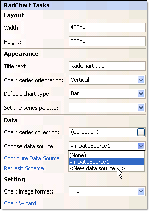
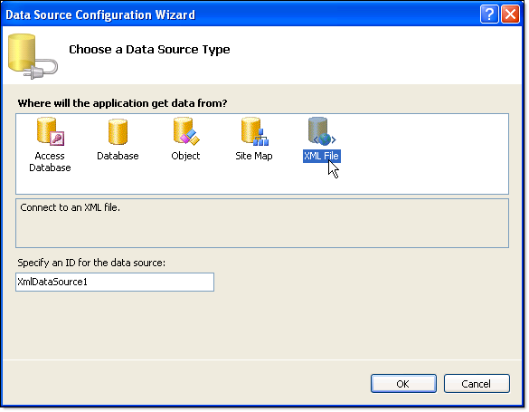
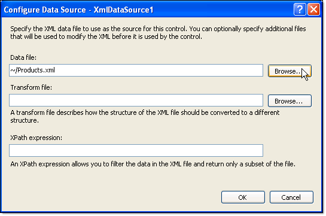

# Binding to XML at Design-Time using an XMLDataSource

>caution  __RadChart__ has been replaced by[RadHtmlChart](http://www.telerik.com/products/aspnet-ajax/html-chart.aspx), Telerik's client-side charting component.	If you are considering __RadChart__ for new development, examine the[RadHtmlChart documentation](ffd58685-7423-4c50-9554-f92c70a75138)and[online demos](http://demos.telerik.com/aspnet-ajax/htmlchart/examples/overview/defaultcs.aspx)first to see if it will fit your development needs.	If you are already using __RadChart__ in your projects, you can migrate to __RadHtmlChart__ by following these articles:[Migrating Series](2f393f28-bc31-459c-92aa-c3599785f6cc),[Migrating Axes](3f1bea81-87b9-4324-b0d2-d13131031048),[Migrating Date Axes](93226130-bc3c-4c53-862a-f9e17b2eb7dd),[Migrating Databinding](d6c5e2f1-280c-4fb0-b5b0-2f507697511d),[Feature parity](010dc716-ce38-480b-9157-572e0f140169).	Support for __RadChart__ is discontinued as of __Q3 2014__ , but the control will remain in the assembly so it can still be used.	We encourage you to use __RadHtmlChart__ for new development.
>

## 

To bind to XML at design-time using an [XMLDataSource](http://msdn2.microsoft.com/en-us/library/system.web.ui.webcontrols.xmldatasource.aspx) control:

1. Click the RadChart [Smart Tag]() "Choose Data Source" | "<New Data Source>".
>caption 

1. From the "Choose a data source type" page of the wizard select "XML File" and click "OK".
>caption 

1. Using the Browse button locate and select the XML file. Click OK.
>caption 

# See Also

 * [Data Binding RadChart to an XML file]()

 * [Binding to XML Directly at Run-Time]()
