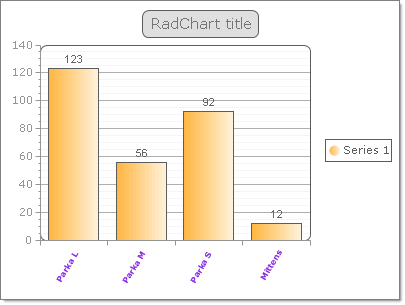

# Binding to XML Directly at Run-Time


>caution  __RadChart__ has been replaced by[RadHtmlChart](http://www.telerik.com/products/aspnet-ajax/html-chart.aspx), Telerik's client-side charting component.	If you are considering __RadChart__ for new development, examine the[RadHtmlChart documentation](ffd58685-7423-4c50-9554-f92c70a75138)and[online demos](http://demos.telerik.com/aspnet-ajax/htmlchart/examples/overview/defaultcs.aspx)first to see if it will fit your development needs.	If you are already using __RadChart__ in your projects, you can migrate to __RadHtmlChart__ by following these articles:[Migrating Series](2f393f28-bc31-459c-92aa-c3599785f6cc),[Migrating Axes](3f1bea81-87b9-4324-b0d2-d13131031048),[Migrating Date Axes](93226130-bc3c-4c53-862a-f9e17b2eb7dd),[Migrating Databinding](d6c5e2f1-280c-4fb0-b5b0-2f507697511d),[Feature parity](010dc716-ce38-480b-9157-572e0f140169).	Support for __RadChart__ is discontinued as of __Q3 2014__ , but the control will remain in the assembly so it can still be used.	We encourage you to use __RadHtmlChart__ for new development.
>


## 

To bind to the data in code at runtime to the XML file directly, use the [Server.MapPath](http://msdn2.microsoft.com/en-us/library/ms524632.aspx) property to locate the XML on disk. The example code below has code that assigns the data and data labels columns as well as massaging the general appearance of the chart.The two critical lines of code that you must have to minimally bind to the XML file are the assignment of the DataSource and the call to DataBind().

>tabbedCode

````C#
	
	    // assign the data source
	    RadChart1.DataSource = Server.MapPath("-/Products.xml");
	    RadChart1.Series[0].DataYColumn = "QuantityInStock";
	    RadChart1.PlotArea.XAxis.DataLabelsColumn = "Name";
	
	    // assign appearance related properties
	    RadChart1.PlotArea.XAxis.Appearance.LabelAppearance.RotationAngle = 300;
	    RadChart1.PlotArea.XAxis.Appearance.TextAppearance.TextProperties.Font =
	     new System.Drawing.Font("Verdana", 6, System.Drawing.FontStyle.Bold);
	    RadChart1.PlotArea.XAxis.Appearance.TextAppearance.TextProperties.Color =
	     System.Drawing.Color.BlueViolet;
	    RadChart1.PlotArea.Appearance.Dimensions.Margins.Bottom =
	     Telerik.Charting.Styles.Unit.Percentage(20);
	
	    // bind to the chart
	    RadChart1.DataBind(); 
	
````


````VB.NET
	
	    ' assign the data source
	    RadChart1.DataSource = Server.MapPath("-/Products.xml")
	    RadChart1.Series(0).DataYColumn = "QuantityInStock"
	    RadChart1.PlotArea.XAxis.DataLabelsColumn = "Name"
	    ' assign appearance related properties
	    RadChart1.PlotArea.XAxis.Appearance.LabelAppearance.RotationAngle = 300
	    RadChart1.PlotArea.XAxis.Appearance.TextAppearance.TextProperties.Font = New System.Drawing.Font("Verdana", 6, System.Drawing.FontStyle.Bold)
	    RadChart1.PlotArea.XAxis.Appearance.TextAppearance.TextProperties.Color = System.Drawing.Color.BlueViolet
	    RadChart1.PlotArea.Appearance.Dimensions.Margins.Bottom = Telerik.Charting.Styles.Unit.Percentage(20)
	    ' bind to the chart
	    RadChart1.DataBind() 
				
````


>end

>tabbedCode

````C#
	
	
	    // assign the data source
	    RadChart1.DataSource = Server.MapPath("-/Products.xml");
	    RadChart1.Series[0].DataYColumn = "QuantityInStock";
	    RadChart1.PlotArea.XAxis.DataLabelsColumn = "Name";
	
	    // assign appearance related properties
	    RadChart1.PlotArea.XAxis.Appearance.LabelAppearance.RotationAngle = 300;
	    RadChart1.PlotArea.XAxis.Appearance.TextAppearance.TextProperties.Font =
	     new System.Drawing.Font("Verdana", 6, System.Drawing.FontStyle.Bold);
	    RadChart1.PlotArea.XAxis.Appearance.TextAppearance.TextProperties.Color =
	     System.Drawing.Color.BlueViolet;
	    RadChart1.PlotArea.Appearance.Dimensions.Margins.Bottom =
	     Telerik.Charting.Styles.Unit.Percentage(20);
	
	    // bind to the chart
	    RadChart1.DataBind(); 
	
````


````VB.NET
	     
	    ' assign the data source
	    RadChart1.DataSource = Server.MapPath("-/Products.xml")
	    RadChart1.Series(0).DataYColumn = "QuantityInStock"
	    RadChart1.PlotArea.XAxis.DataLabelsColumn = "Name"
	    ' assign appearance related properties
	    RadChart1.PlotArea.XAxis.Appearance.LabelAppearance.RotationAngle = 300
	    RadChart1.PlotArea.XAxis.Appearance.TextAppearance.TextProperties.Font = New System.Drawing.Font("Verdana", 6, System.Drawing.FontStyle.Bold)
	    RadChart1.PlotArea.XAxis.Appearance.TextAppearance.TextProperties.Color = System.Drawing.Color.BlueViolet
	    RadChart1.PlotArea.Appearance.Dimensions.Margins.Bottom = Telerik.Charting.Styles.Unit.Percentage(20)
	    ' bind to the chart
	    RadChart1.DataBind() 
				
````


>end

The running application looks something like the figure shown below.
>caption 




# See Also

 * [Data Binding RadChart to an XML file]()

 * [Binding to XML at Design-Time using an XMLDataSource]()
