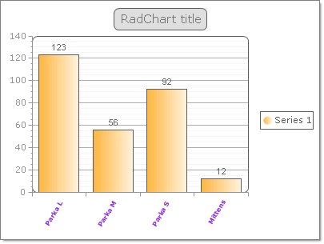

# Binding to XML Directly at Run-Time

>caution **RadChart** has been deprecated since Q3 2014 and is marked as obsolete as of the 2026 Q2 SP1 (v2026.2.708) release. This is the last release that includes the RadChart component — its source code will be removed from the assembly in the next release. We strongly recommend using [RadHtmlChart](https://www.telerik.com/products/aspnet-ajax/html-chart.aspx), Telerik's modern client-side charting component. 
>To transition from RadChart to RadHtmlChart, refer to the following migration articles:
> - [Migrating Series]()
> - [Migrating Axes]()
> - [Migrating Date Axes]()
> - [Migrating Databinding]()
> - [Features parity]()
>Explore the [RadHtmlChart documentation]() and online demos to determine how it fits your development needs.

To bind to the data in code at runtime to the XML file directly, use the [Server.MapPath](https://msdn2.microsoft.com/en-us/library/ms524632.aspx) property to locate the XML on disk. The example code below has code that assigns the data and data labels columns as well as massaging the general appearance of the chart.The two critical lines of code that you must have to minimally bind to the XML file are the assignment of the DataSource and the call to DataBind().

````C#
// assign the data source
RadChart1.DataSource = Server.MapPath("-/Products.xml");
RadChart1.Series[0].DataYColumn = "QuantityInStock";
RadChart1.PlotArea.XAxis.DataLabelsColumn = "Name";

// assign appearance related properties
RadChart1.PlotArea.XAxis.Appearance.LabelAppearance.RotationAngle = 300;
RadChart1.PlotArea.XAxis.Appearance.TextAppearance.TextProperties.Font =
 new System.Drawing.Font("Verdana", 6, System.Drawing.FontStyle.Bold);
RadChart1.PlotArea.XAxis.Appearance.TextAppearance.TextProperties.Color =
 System.Drawing.Color.BlueViolet;
RadChart1.PlotArea.Appearance.Dimensions.Margins.Bottom =
 Telerik.Charting.Styles.Unit.Percentage(20);

// bind to the chart
RadChart1.DataBind(); 
	
````
````VB	
' assign the data source
RadChart1.DataSource = Server.MapPath("-/Products.xml")
RadChart1.Series(0).DataYColumn = "QuantityInStock"
RadChart1.PlotArea.XAxis.DataLabelsColumn = "Name"
' assign appearance related properties
RadChart1.PlotArea.XAxis.Appearance.LabelAppearance.RotationAngle = 300
RadChart1.PlotArea.XAxis.Appearance.TextAppearance.TextProperties.Font = New System.Drawing.Font("Verdana", 6, System.Drawing.FontStyle.Bold)
RadChart1.PlotArea.XAxis.Appearance.TextAppearance.TextProperties.Color = System.Drawing.Color.BlueViolet
RadChart1.PlotArea.Appearance.Dimensions.Margins.Bottom = Telerik.Charting.Styles.Unit.Percentage(20)
' bind to the chart
RadChart1.DataBind()				
````

````C#	
// assign the data source
RadChart1.DataSource = Server.MapPath("-/Products.xml");
RadChart1.Series[0].DataYColumn = "QuantityInStock";
RadChart1.PlotArea.XAxis.DataLabelsColumn = "Name";

// assign appearance related properties
RadChart1.PlotArea.XAxis.Appearance.LabelAppearance.RotationAngle = 300;
RadChart1.PlotArea.XAxis.Appearance.TextAppearance.TextProperties.Font =
 new System.Drawing.Font("Verdana", 6, System.Drawing.FontStyle.Bold);
RadChart1.PlotArea.XAxis.Appearance.TextAppearance.TextProperties.Color =
 System.Drawing.Color.BlueViolet;
RadChart1.PlotArea.Appearance.Dimensions.Margins.Bottom =
 Telerik.Charting.Styles.Unit.Percentage(20);

// bind to the chart
RadChart1.DataBind(); 
````
````VB	     
' assign the data source
RadChart1.DataSource = Server.MapPath("-/Products.xml")
RadChart1.Series(0).DataYColumn = "QuantityInStock"
RadChart1.PlotArea.XAxis.DataLabelsColumn = "Name"
' assign appearance related properties
RadChart1.PlotArea.XAxis.Appearance.LabelAppearance.RotationAngle = 300
RadChart1.PlotArea.XAxis.Appearance.TextAppearance.TextProperties.Font = New System.Drawing.Font("Verdana", 6, System.Drawing.FontStyle.Bold)
RadChart1.PlotArea.XAxis.Appearance.TextAppearance.TextProperties.Color = System.Drawing.Color.BlueViolet
RadChart1.PlotArea.Appearance.Dimensions.Margins.Bottom = Telerik.Charting.Styles.Unit.Percentage(20)
' bind to the chart
RadChart1.DataBind()				
````

The running application looks something like the figure shown below.



# See Also

 * [Data Binding RadChart to an XML file]()

 * [Binding to XML at Design-Time using an XMLDataSource]()
