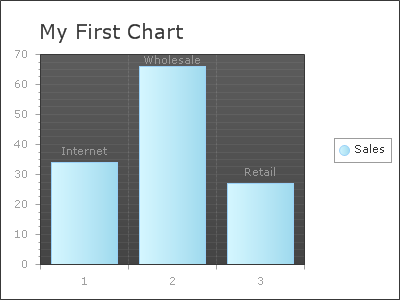

# Creating RadChart Declaratively


>caution  **RadChart** has been replaced by[RadHtmlChart](http://www.telerik.com/products/aspnet-ajax/html-chart.aspx), Telerik's client-side charting component.	If you are considering **RadChart** for new development, examine the[RadHtmlChart documentation](ffd58685-7423-4c50-9554-f92c70a75138)and[online demos](http://demos.telerik.com/aspnet-ajax/htmlchart/examples/overview/defaultcs.aspx)first to see if it will fit your development needs.	If you are already using **RadChart** in your projects, you can migrate to **RadHtmlChart** by following these articles:[Migrating Series](2f393f28-bc31-459c-92aa-c3599785f6cc),[Migrating Axes](3f1bea81-87b9-4324-b0d2-d13131031048),[Migrating Date Axes](93226130-bc3c-4c53-862a-f9e17b2eb7dd),[Migrating Databinding](d6c5e2f1-280c-4fb0-b5b0-2f507697511d),[Feature parity](010dc716-ce38-480b-9157-572e0f140169).	Support for **RadChart** is discontinued as of **Q3 2014** , but the control will remain in the assembly so it can still be used.	We encourage you to use **RadHtmlChart** for new development.
>


## 

RadChart properties that are set in the designer can also be written declaratively in the ASP.NET HTML code.

1. To use the RadChart control on the page you need to declare the namespace and associate a tag prefix.Add the following code just under the "<%@ Page>" tag at the top of the HTML.

````ASPNET
	    <%@ register assembly="Telerik.Web.UI" namespace="Telerik.Web.UI" tagprefix="telerik" %>
	    <%@ register assembly="Telerik.Web.UI" namespace="Telerik.Charting" tagprefix="telerik" %>
````


1. Within the main div tag for the page add a RadChart tag.

````ASPNET
	    <div>
	        <telerik:RadChart runat="Server" id="myRadChart">
	        </telerik:RadChart>
	    </div>
````


1. Within the RadChart tag add a ChartTitle tag and set its TextBlock-Text attribute to "My First Chart".

````ASPNET
	    <ChartTitle>
	    <TextBlock Text="My First Chart">
	    </TextBlock>
	    </ChartTitle> 
````


1. Add a ChartSeries tag. Set the Name attribute to "Sales".

````ASPNET
	    <Series>
	    <telerik:ChartSeries Name="Sales">
	    </telerik:ChartSeries>
	    </Series> 
````


1. Add three ChartSeriesItem tags inside the ChartSeries tag as shown in the example below.Set the YValue attribute for each item.Add a TextBlock tag within each ChartSeriesItem tag and set the Text attribute to the values shown in the example.

````ASPNET
	    <items>
	    <telerik:ChartSeriesItem YValue="34">
	    <Label><TextBlock Text="Internet"></TextBlock></Label>
	    </telerik:ChartSeriesItem>
	    <telerik:ChartSeriesItem YValue="66">
	    <Label><TextBlock Text="Wholesale"></TextBlock></Label>
	    </telerik:ChartSeriesItem>
	    <telerik:ChartSeriesItem YValue="27">
	    <Label><TextBlock Text="Retail"></TextBlock></Label>
	    </telerik:ChartSeriesItem>
	    </items> 
````

The chart should now look like the figure below.The chart will display as three bars (Bar is the default type).
>caption 



1. Add an Appearance tag to the RadChart Series tag. Within Appearance add a FillStyle tag, set the MainColor attribute to "Red" and the SecondColor attribute to Maroon. Add a Border tag and set the color to DarkRed.Then add PlotArea tag and Appearance tag within it

````ASPNET
	    <Appearance>
	    <FillStyle MainColor="Red" SecondColor="Maroon"></FillStyle>
	    <Border Color="DarkRed" />
	    </Appearance> 
````


````ASPNET
	    <PlotArea>
	    <Appearance>
	    <FillStyle FillType="Solid" MainColor="White"></FillStyle>
	    </Appearance>
	    </PlotArea> 
````


When complete the chart should look like this example:
>caption 


# See Also

 * [Building RadCharts]()

 * [Populate RadChart at Design-Time]()

 * [Creating RadChart Programmatically]()
