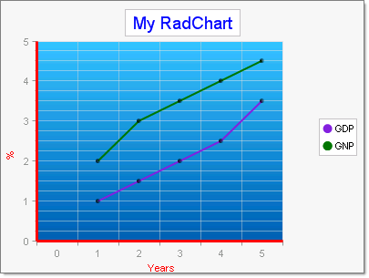

# Creating RadChart Programmatically - more complex example


>caution  __RadChart__ has been replaced by[RadHtmlChart](http://www.telerik.com/products/aspnet-ajax/html-chart.aspx), Telerik's client-side charting component.	If you are considering __RadChart__ for new development, examine the[RadHtmlChart documentation](ffd58685-7423-4c50-9554-f92c70a75138)and[online demos](http://demos.telerik.com/aspnet-ajax/htmlchart/examples/overview/defaultcs.aspx)first to see if it will fit your development needs.	If you are already using __RadChart__ in your projects, you can migrate to __RadHtmlChart__ by following these articles:[Migrating Series](2f393f28-bc31-459c-92aa-c3599785f6cc),[Migrating Axes](3f1bea81-87b9-4324-b0d2-d13131031048),[Migrating Date Axes](93226130-bc3c-4c53-862a-f9e17b2eb7dd),[Migrating Databinding](d6c5e2f1-280c-4fb0-b5b0-2f507697511d),[Feature parity](010dc716-ce38-480b-9157-572e0f140169).	Support for __RadChart__ is discontinued as of __Q3 2014__ , but the control will remain in the assembly so it can still be used.	We encourage you to use __RadHtmlChart__ for new development.
>


## 
>caption 



The figure above shows a more complex chart than the [minimal example of programmatically created RadChart]().This example demonstrates how to:

* Create the chart, define the chart title and the title's appearance.

* Define two different chart series, how to hide the series labels and tailor the series appearance.

* Add multiple chart series items with data.

* How to display point marks to highlight the data points.

* Fill the plot area background with a gradient color.

* Set axis line and label appearance.

>tabbedCode

````C#
	
	
	        // Define chart and titleRadChart radChart = new RadChart();
	        radChart.ChartTitle.TextBlock.Text = "My RadChart";
	        radChart.ChartTitle.TextBlock.Appearance.TextProperties.Color = System.Drawing.Color.Blue;
	        // Define chart series
	        ChartSeries chartSeries = new ChartSeries();
	        chartSeries.Appearance.LabelAppearance.Visible = false;
	        chartSeries.Name = "GDP";
	        chartSeries.Type = ChartSeriesType.Line;
	        chartSeries.Appearance.LineSeriesAppearance.Color = System.Drawing.Color.BlueViolet;
	        // Define the items in the series
	        chartSeries.AddItem(1);
	        chartSeries.AddItem(1.5);
	        chartSeries.AddItem(2.0);
	        chartSeries.AddItem(2.5);
	        chartSeries.AddItem(3.5);
	        // visually enhance the datapoints
	        chartSeries.Appearance.PointMark.Dimensions.AutoSize = false;
	        chartSeries.Appearance.PointMark.Dimensions.Width = 5;
	        chartSeries.Appearance.PointMark.Dimensions.Height = 5;
	        chartSeries.Appearance.PointMark.FillStyle.MainColor = System.Drawing.Color.Black;
	        chartSeries.Appearance.PointMark.Visible = true;
	        // Define chart series
	        ChartSeries chartSeries2 = new ChartSeries();
	        chartSeries2.Appearance.LabelAppearance.Visible = false;
	        chartSeries2.Name = "GNP";
	        chartSeries2.Type = ChartSeriesType.Line;
	        chartSeries2.Appearance.LineSeriesAppearance.Color = System.Drawing.Color.Green;
	        // Define the items in the series
	        chartSeries2.AddItem(2);
	        chartSeries2.AddItem(3);
	        chartSeries2.AddItem(3.5);
	        chartSeries2.AddItem(4);
	        chartSeries2.AddItem(4.5);
	        // visually enhance the data points
	        chartSeries2.Appearance.PointMark.Dimensions.AutoSize = false;
	        chartSeries2.Appearance.PointMark.Dimensions.Width = 5;
	        chartSeries2.Appearance.PointMark.Dimensions.Height = 5;
	        chartSeries2.Appearance.PointMark.FillStyle.MainColor = System.Drawing.Color.Black;
	        chartSeries2.Appearance.PointMark.Visible = true;
	        // set the plot area gradient background fill
	        radChart.PlotArea.Appearance.FillStyle.FillType = Telerik.Charting.Styles.FillType.Gradient;
	        radChart.PlotArea.Appearance.FillStyle.MainColor = System.Drawing.Color.FromArgb(65, 201, 254);
	        radChart.PlotArea.Appearance.FillStyle.SecondColor = System.Drawing.Color.FromArgb(0, 107, 186);
	        // Set text and line for X axis
	        radChart.PlotArea.XAxis.AxisLabel.TextBlock.Text = "Years";
	        radChart.PlotArea.XAxis.AxisLabel.TextBlock.Appearance.TextProperties.Color = System.Drawing.Color.Red;
	        radChart.PlotArea.XAxis.Appearance.Width = 3;
	        radChart.PlotArea.XAxis.Appearance.Color = System.Drawing.Color.Red;
	        // Set text and line for Y axis
	        radChart.PlotArea.YAxis.AxisLabel.TextBlock.Text = "%";
	        radChart.PlotArea.YAxis.AxisLabel.TextBlock.Appearance.TextProperties.Color = System.Drawing.Color.Red;
	        radChart.PlotArea.YAxis.Appearance.Width = 3;
	        radChart.PlotArea.YAxis.Appearance.Color = System.Drawing.Color.Red;
	        // Add the series to the chart, chart to page.radChart.Series.Add(chartSeries);radChart.Series.Add(chartSeries2);this.Page.Controls.Add(radChart)
	
````


````VB.NET
	
	    ' Define chart and title
	    Dim radChart As New RadChart()
	    radChart.ChartTitle.TextBlock.Text = "My RadChart"
	    radChart.ChartTitle.TextBlock.Appearance.TextProperties.Color = System.Drawing.Color.Blue
	    ' Define chart series
	    Dim chartSeries As New ChartSeries()
	    chartSeries.Appearance.LabelAppearance.Visible = False
	    chartSeries.Name = "GDP"
	    chartSeries.Type = ChartSeriesType.Line
	    chartSeries.Appearance.LineSeriesAppearance.Color = System.Drawing.Color.BlueViolet
	    ' Define the items in the series
	    chartSeries.AddItem(1)
	    chartSeries.AddItem(1.5)
	    chartSeries.AddItem(2)
	    chartSeries.AddItem(2.5)
	    chartSeries.AddItem(3.5)
	    ' visually enhance the data points
	    chartSeries.Appearance.PointMark.Dimensions.AutoSize = False
	    chartSeries.Appearance.PointMark.Dimensions.Width = 5
	    chartSeries.Appearance.PointMark.Dimensions.Height = 5
	    chartSeries.Appearance.PointMark.FillStyle.MainColor = System.Drawing.Color.Black
	    chartSeries.Appearance.PointMark.Visible = True
	    ' Define chart series
	    Dim chartSeries2 As New ChartSeries()
	    chartSeries2.Appearance.LabelAppearance.Visible = False
	    chartSeries2.Name = "GNP"
	    chartSeries2.Type = ChartSeriesType.Line
	    chartSeries2.Appearance.LineSeriesAppearance.Color = System.Drawing.Color.Green
	    ' Define the items in the series
	    chartSeries2.AddItem(2)
	    chartSeries2.AddItem(3)
	    chartSeries2.AddItem(3.5)
	    chartSeries2.AddItem(4)
	    chartSeries2.AddItem(4.5)
	    ' visually enhance the data points
	    chartSeries.Appearance.PointMark.Dimensions.AutoSize = False
	    chartSeries2.Appearance.PointMark.Dimensions.Width = 5
	    chartSeries2.Appearance.PointMark.Dimensions.Height = 5
	    chartSeries2.Appearance.PointMark.FillStyle.MainColor = System.Drawing.Color.Black
	    chartSeries2.Appearance.PointMark.Visible = True
	    ' set the plot area gradient background fill
	    radChart.PlotArea.Appearance.FillStyle.FillType = Telerik.Charting.Styles.FillType.Gradient
	    radChart.PlotArea.Appearance.FillStyle.MainColor = System.Drawing.Color.FromArgb(65, 201, 254)
	    radChart.PlotArea.Appearance.FillStyle.SecondColor = System.Drawing.Color.FromArgb(0, 107, 186)
	    ' Set text and line for X axis
	    radChart.PlotArea.XAxis.AxisLabel.TextBlock.Text = "Years"
	    radChart.PlotArea.XAxis.AxisLabel.TextBlock.Appearance.TextProperties.Color = System.Drawing.Color.Red
	    radChart.PlotArea.XAxis.Appearance.Width = 3
	    radChart.PlotArea.XAxis.Appearance.Color = System.Drawing.Color.Red
	    ' Set text and line for Y axis
	    radChart.PlotArea.YAxis.AxisLabel.TextBlock.Text = "%"
	    radChart.PlotArea.YAxis.AxisLabel.TextBlock.Appearance.TextProperties.Color = System.Drawing.Color.Red
	    radChart.PlotArea.YAxis.Appearance.Width = 3
	    radChart.PlotArea.YAxis.Appearance.Color = System.Drawing.Color.Red
	    ' Add the series to the chart, chart to page.
	    radChart.Series.Add(chartSeries)
	    radChart.Series.Add(chartSeries2)
	    Me.Page.Controls.Add(radChart) 
	
````


>end

# See Also

 * [Creating RadChart Programmatically]()
