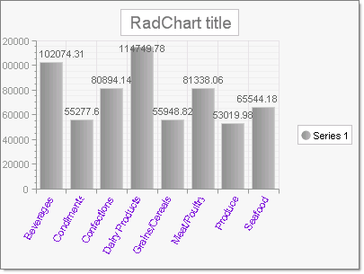

# Data Binding RadChart to a Database Object


>caution  __RadChart__ has been replaced by[RadHtmlChart](http://www.telerik.com/products/aspnet-ajax/html-chart.aspx), Telerik's client-side charting component.	If you are considering __RadChart__ for new development, examine the[RadHtmlChart documentation](ffd58685-7423-4c50-9554-f92c70a75138)and[online demos](http://demos.telerik.com/aspnet-ajax/htmlchart/examples/overview/defaultcs.aspx)first to see if it will fit your development needs.	If you are already using __RadChart__ in your projects, you can migrate to __RadHtmlChart__ by following these articles:[Migrating Series](2f393f28-bc31-459c-92aa-c3599785f6cc),[Migrating Axes](3f1bea81-87b9-4324-b0d2-d13131031048),[Migrating Date Axes](93226130-bc3c-4c53-862a-f9e17b2eb7dd),[Migrating Databinding](d6c5e2f1-280c-4fb0-b5b0-2f507697511d),[Feature parity](010dc716-ce38-480b-9157-572e0f140169).	Support for __RadChart__ is discontinued as of __Q3 2014__ , but the control will remain in the assembly so it can still be used.	We encourage you to use __RadHtmlChart__ for new development.
>


## 

To bind to a database, create a data source object, assign the data source to the RadChart and call the RadChart DataBind() method.
>caption 



The figure above shows a running example that starts with a default RadChart with a single Series. The example code:

* Creates a [SqlDataSource](http://msdn2.microsoft.com/en-us/library/system.web.ui.webcontrols.sqldatasource.aspx)__,__ adds it to the page, assigns the RadChart__DataSourceID__ property and finally binds to the datasource.

* Displays data for a database column by assigning the series DataYColumn or DataXColumn properties. In the example the "TotalSales" column is assigned to the DataYColumn property.

* Displays database column data in the X axis labels by assigning the column name to the DataLabelsColumn__.__The example assigns "CategoryName" to the DataLabelsColumn property.

>note Also note how the example sets the PlotArea.Appearance.Dimensions.Margins.Bottom to 30% and the PlotArea.XAxis.Appearance.LabelAppearance.RotationAngle to 300 in order to provide room for the axis labels.
>


>tabbedCode

````C#
	     
	using System;
	using System.Configuration;
	using System.Web.UI.WebControls;
	// Supports RadChart declaration
	using Telerik.Web.UI;
	// Supports RadChart objects, i.e. series, items
	using Telerik.Charting;
	namespace DatabindingExample
	{
	   public partial class _Default : System.Web.UI.Page
	   {
	       protected void Page_Load(object sender, EventArgs e)
	       {
	           // create a datasource, add it to the page,
	           // and assign the datasource to RadChart
	           SqlDataSource sqlDataSource = new SqlDataSource();
	           sqlDataSource.ID = "myDataSource";
	           sqlDataSource.ConnectionString =
	           ConfigurationManager.ConnectionStrings["NorthwindConnectionString"].ConnectionString;
	           sqlDataSource.SelectCommand =
	           "SELECT CategoryName, SUM(ProductSales) AS TotalSales FROM [Product Sales for 1997] GROUP BY CategoryName";
	           this.Page.Controls.Add(sqlDataSource);
	           RadChart1.DataSourceID = "myDataSource";
	           // Set the column for data and data labels:
	           // Each bar will show "TotalSales", each label along
	           // X-axis will show "CategoryName.
	           RadChart1.Series[0].DataYColumn = "TotalSales";
	           RadChart1.PlotArea.XAxis.DataLabelsColumn = "CategoryName";
	           // assign appearance related properties
	           RadChart1.PlotArea.XAxis.Appearance.LabelAppearance.RotationAngle = 300;
	           RadChart1.PlotArea.XAxis.Appearance.TextAppearance.TextProperties.Color =
	           System.Drawing.Color.BlueViolet;
	           RadChart1.PlotArea.Appearance.Dimensions.Margins.Bottom =
	           Telerik.Charting.Styles.Unit.Percentage(30);
	           // bind to the datasource
	           RadChart1.DataBind();
	       }
	   }
	} 
				
````
````VB.NET
	
	    Imports System
	    Imports System.Configuration
	    Imports System.Web.UI.WebControls
	    ' Supports RadChart declaration
	    Imports Telerik.Web.UI
	    ' Supports RadChart objects, i.e. series, items
	    Imports Telerik.Charting
	    Namespace DatabindingExample
	        Partial Public Class _Default
	            Inherits System.Web.UI.Page
	            Protected Sub Page_Load(ByVal sender As Object, ByVal e As EventArgs)
	                ' create a datasource and add it to the page
	                Dim sqlDataSource As New SqlDataSource()
	                sqlDataSource.ID = "myDataSource"
	                sqlDataSource.ConnectionString = ConfigurationManager.ConnectionStrings("NorthwindConnectionString").ConnectionString
	                sqlDataSource.SelectCommand = "SELECT CategoryName, SUM(ProductSales) AS TotalSales FROM [Product Sales for 1997] GROUP BY CategoryName"
	                Me.Page.Controls.Add(sqlDataSource)
	                ' Set the column for data and data labels:
	                ' Each bar will show "TotalSales", each label along
	                ' X-axis will show "CategoryName.
	                RadChart1.Series(0).DataYColumn = "TotalSales"
	                RadChart1.PlotArea.XAxis.DataLabelsColumn = "CategoryName"
	                ' assign appearance related properties
	                RadChart1.PlotArea.XAxis.Appearance.LabelAppearance.RotationAngle = 300
	                RadChart1.PlotArea.XAxis.Appearance.TextAppearance.TextProperties.Color = System.Drawing.Color.BlueViolet
	                RadChart1.PlotArea.Appearance.Dimensions.Margins.Bottom = Telerik.Charting.Styles.Unit.Percentage(30)
	                ' assign the chart data source and bind it
	                RadChart1.DataSourceID = "myDataSource"
	                RadChart1.DataBind()
	            End Sub
	        End Class
	    End Namespace
	
````
>end


# See Also

 * [Data Binding RadChart]()

 * [Data Binding RadChart to an Array]()

 * [Data Binding RadChart to a Generic List]()

 * [Data Binding RadChart to an ObjectDataSource]()

 * [Data Binding RadChart to an XML file]()
