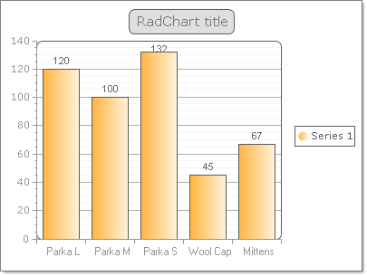

# Data Binding RadChart to a Generic List of Objects

>caution  **RadChart** has been replaced by[RadHtmlChart](http://www.telerik.com/products/aspnet-ajax/html-chart.aspx), Telerik's client-side charting component.	If you are considering **RadChart** for new development, examine the[RadHtmlChart documentation](ffd58685-7423-4c50-9554-f92c70a75138)and[online demos](http://demos.telerik.com/aspnet-ajax/htmlchart/examples/overview/defaultcs.aspx)first to see if it will fit your development needs.	If you are already using **RadChart** in your projects, you can migrate to **RadHtmlChart** by following these articles:[Migrating Series](2f393f28-bc31-459c-92aa-c3599785f6cc),[Migrating Axes](3f1bea81-87b9-4324-b0d2-d13131031048),[Migrating Date Axes](93226130-bc3c-4c53-862a-f9e17b2eb7dd),[Migrating Databinding](d6c5e2f1-280c-4fb0-b5b0-2f507697511d),[Feature parity](010dc716-ce38-480b-9157-572e0f140169).	Support for **RadChart** is discontinued as of **Q3 2014** , but the control will remain in the assembly so it can still be used.	We encourage you to use **RadHtmlChart** for new development.

You can bind to a [generic lists](http://msdn2.microsoft.com/en-us/library/6sh2ey19.aspx) of objects that have multiple properties. The example below binds to a list of "Product" objects that contain two properties, one property for "Name" and a second for "QuantityInStock". The Y axis binds to the QuantityInStock and the X axis label binds to the "Name" property.



The Product object is defined with a constructor that passes both Name and QuantityInStock:

````C#
public class Product
{
   public Product(string name, int quantityInStock)
   {
	   _name = name;
	   _quantityInStock = quantityInStock;
   }
   private string _name;
   public string Name
   {
	   get { return _name; }
	   set { _name = value; }
   }
   private int _quantityInStock;
   public int QuantityInStock
   {
	   get { return _quantityInStock; }
	   set { _quantityInStock = value; }
   }
} 				
````
````VB
Public Class Product
	Public Sub New(ByVal name As String, ByVal quantityInStock As Integer)
		_name = name
		_quantityInStock = quantityInStock
	End Sub
	Private _name As String
	Public Property Name() As String
		Get
			Return _name
		End Get
		Set(ByVal value As String)
			_name = value
		End Set
	End Property
	Private _quantityInStock As Integer
	Public Property QuantityInStock() As Integer
		Get
			Return _quantityInStock
		End Get
		Set(ByVal value As Integer)
			_quantityInStock = value
		End Set
	End Property
End Class
````

After the Product object is defined the following steps configure and bind to the generic List:

1. A generic List of Product objects is created and assigned to the RadChart DataSource= property.

1. The DataYColumn property of the series is assigned the numeric "QuantityInStock" property of the Product object.

1. The XAxis DataLabelsColumn is assigned the "Name" property of the the Product object.

1. The RadChart DataBind()= method is called.

````C#
List<Product> products = new List<Product>();
products.Add(new Product("Parka L", 120));
products.Add(new Product("Parka M", 100));
products.Add(new Product("Parka S", 132));
products.Add(new Product("Wool Cap", 45));
products.Add(new Product("Mittens", 67));
RadChart1.DataSource = products;
RadChart1.Series[0].DataYColumn = "QuantityInStock";
RadChart1.PlotArea.XAxis.DataLabelsColumn = "Name";
RadChart1.PlotArea.XAxis.Appearance.TextAppearance.TextProperties.Font = new System.Drawing.Font("Arial", 8);
RadChart1.DataBind();				
````
````VB	
Dim products As New List(Of Product)()
products.Add(New Product("Parka L", 120))
products.Add(New Product("Parka M", 100))
products.Add(New Product("Parka S", 132))
products.Add(New Product("Wool Cap", 45))
products.Add(New Product("Mittens", 67))
RadChart1.DataSource = products
RadChart1.Series(0).DataYColumn = "QuantityInStock"
RadChart1.PlotArea.XAxis.DataLabelsColumn = "Name"
RadChart1.PlotArea.XAxis.Appearance.TextAppearance.TextProperties.Font = New System.Drawing.Font("Arial", 8)
RadChart1.DataBind()	
````

# See Also

 * [Data Binding RadChart to a Generic List]()

 * [Data Binding RadChart to a Generic List of Simple Types]()
