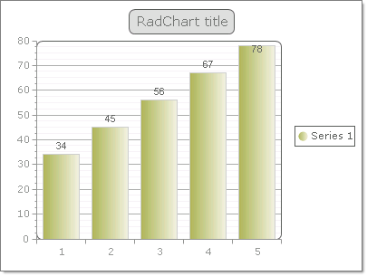

# Data Binding RadChart to a Generic List of Simple Types


>caution  **RadChart** has been replaced by[RadHtmlChart](http://www.telerik.com/products/aspnet-ajax/html-chart.aspx), Telerik's client-side charting component.	If you are considering **RadChart** for new development, examine the[RadHtmlChart documentation](ffd58685-7423-4c50-9554-f92c70a75138)and[online demos](http://demos.telerik.com/aspnet-ajax/htmlchart/examples/overview/defaultcs.aspx)first to see if it will fit your development needs.	If you are already using **RadChart** in your projects, you can migrate to **RadHtmlChart** by following these articles:[Migrating Series](2f393f28-bc31-459c-92aa-c3599785f6cc),[Migrating Axes](3f1bea81-87b9-4324-b0d2-d13131031048),[Migrating Date Axes](93226130-bc3c-4c53-862a-f9e17b2eb7dd),[Migrating Databinding](d6c5e2f1-280c-4fb0-b5b0-2f507697511d),[Feature parity](010dc716-ce38-480b-9157-572e0f140169).	Support for **RadChart** is discontinued as of **Q3 2014** , but the control will remain in the assembly so it can still be used.	We encourage you to use **RadHtmlChart** for new development.
>


The example below is the result of binding a [generic List<>](http://msdn2.microsoft.com/en-us/library/6sh2ey19.aspx) of double to the RadChartDataSource property and calling the DataBind() method.
>caption 




````C#
	
	     
	List<double> chartData = new List<double>();
	chartData.Add(34);
	chartData.Add(45);
	chartData.Add(56);
	chartData.Add(67);
	chartData.Add(78);
	RadChart1.DataSource = chartData;
	RadChart1.DataBind();
				
````
````VB.NET
	     
	    Dim chartData As New List(Of Double)()
	    chartData.Add(34)
	    chartData.Add(45)
	    chartData.Add(56)
	    chartData.Add(67)
	    chartData.Add(78)
	    RadChart1.DataSource = chartDataRadChart1.DataBind()
				
````


# See Also

 * [Data Binding RadChart to a Generic List]()

 * [Data Binding RadChart to a Generic List of Objects]()
