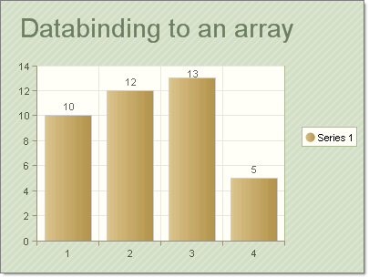

# Data Binding RadChart to an Array

>caution  **RadChart** has been replaced by[RadHtmlChart](http://www.telerik.com/products/aspnet-ajax/html-chart.aspx), Telerik's client-side charting component.	If you are considering **RadChart** for new development, examine the[RadHtmlChart documentation](ffd58685-7423-4c50-9554-f92c70a75138)and[online demos](http://demos.telerik.com/aspnet-ajax/htmlchart/examples/overview/defaultcs.aspx)first to see if it will fit your development needs.	If you are already using **RadChart** in your projects, you can migrate to **RadHtmlChart** by following these articles:[Migrating Series](2f393f28-bc31-459c-92aa-c3599785f6cc),[Migrating Axes](3f1bea81-87b9-4324-b0d2-d13131031048),[Migrating Date Axes](93226130-bc3c-4c53-862a-f9e17b2eb7dd),[Migrating Databinding](d6c5e2f1-280c-4fb0-b5b0-2f507697511d),[Feature parity](010dc716-ce38-480b-9157-572e0f140169).	Support for **RadChart** is discontinued as of **Q3 2014** , but the control will remain in the assembly so it can still be used.	We encourage you to use **RadHtmlChart** for new development.

To bind a RadChart to an [Array](http://msdn2.microsoft.com/en-us/library/system.array(VS.71).aspx) object, assign the RadChart DataSource property to the array, then call the RadChart DataBind() method. The example below demonstrates data binding to an array of integers.



````C#
protected void Page_Load(object sender, EventArgs e)
{
   int[] intArray = new int[4] { 10, 12, 13, 5 };
   RadChart1.DataSource = intArray;
   RadChart1.DataBind();
} 			
````
````VB
Protected Sub Page_Load(ByVal sender As Object, ByVal e As EventArgs)
	Dim intArray As Integer() = New Integer(4) {10, 12, 13, 5}
	RadChart1.DataSource = intArray
	RadChart1.DataBind()
End Sub
````

# See Also

 * [Data Binding RadChart to a Database Object]()

 * [Data Binding RadChart to a Generic List]()

 * [Data Binding RadChart to an ObjectDataSource]()

 * [Data Binding RadChart to an XML file]()

 * [Data Binding RadChart]()
