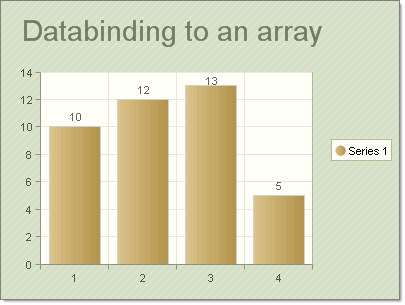

# Data Binding RadChart to an Array

>caution **RadChart** has been deprecated since Q3 2014 and is marked as obsolete as of the 2026 Q2 SP1 (v2026.2.708) release. This is the last release that includes the RadChart component — its source code will be removed from the assembly in the next release. We strongly recommend using [RadHtmlChart](https://www.telerik.com/products/aspnet-ajax/html-chart.aspx), Telerik's modern client-side charting component. 
>To transition from RadChart to RadHtmlChart, refer to the following migration articles:
> - [Migrating Series]()
> - [Migrating Axes]()
> - [Migrating Date Axes]()
> - [Migrating Databinding]()
> - [Features parity]()
>Explore the [RadHtmlChart documentation]() and online demos to determine how it fits your development needs.

To bind a RadChart to an [Array](https://msdn2.microsoft.com/en-us/library/system.array(VS.71).aspx) object, assign the RadChart DataSource property to the array, then call the RadChart DataBind() method. The example below demonstrates data binding to an array of integers.



````C#
protected void Page_Load(object sender, EventArgs e)
{
   int[] intArray = new int[4] { 10, 12, 13, 5 };
   RadChart1.DataSource = intArray;
   RadChart1.DataBind();
} 			
````
````VB
Protected Sub Page_Load(ByVal sender As Object, ByVal e As EventArgs)
	Dim intArray As Integer() = New Integer(4) {10, 12, 13, 5}
	RadChart1.DataSource = intArray
	RadChart1.DataBind()
End Sub
````

# See Also

 * [Data Binding RadChart to a Database Object]()

 * [Data Binding RadChart to a Generic List]()

 * [Data Binding RadChart to an ObjectDataSource]()

 * [Data Binding RadChart to an XML file]()

 * [Data Binding RadChart]()
