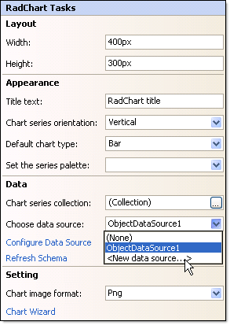
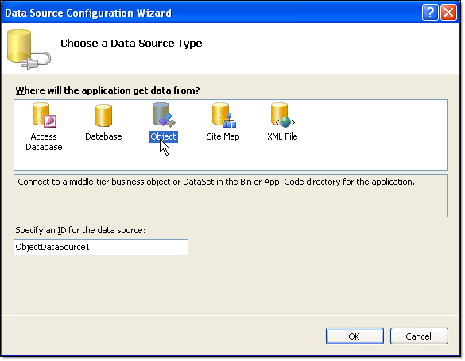
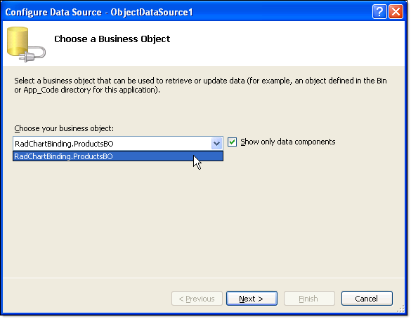
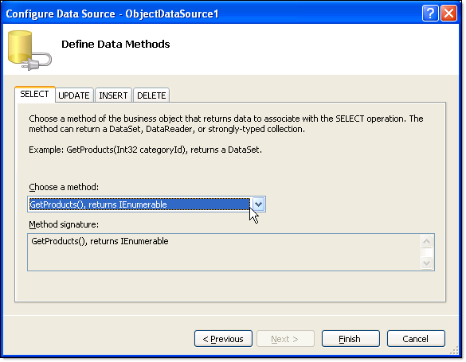

# Data Binding RadChart to ObjectDataSource at Design-Time

>caution  **RadChart** has been replaced by [RadHtmlChart](https://www.telerik.com/products/aspnet-ajax/html-chart.aspx), Telerik's client-side charting component. If you are considering **RadChart** for new development, examine the [RadHtmlChart documentation]() and [online demos](https://demos.telerik.com/aspnet-ajax/htmlchart/examples/overview/defaultcs.aspx) first to see if it will fit your development needs. If you are already using **RadChart** in your projects, you can migrate to **RadHtmlChart** by following these articles: [Migrating Series](), [Migrating Axes](), [Migrating Date Axes](), [Migrating Databinding](), [Features parity](). Support for **RadChart** is discontinued as of **Q3 2014**, but the control will remain in the assembly so it can still be used. We encourage you to use **RadHtmlChart** for new development.

Use the Data Source Configuration Wizard to bind [ObjectDataSource](https://msdn2.microsoft.com/en-us/library/system.web.ui.webcontrols.objectdatasource.aspx)at design time:

1. Click the RadChart [Smart Tag]() "Choose Data Source" | "New Data Source".

	

1. From the "Choose a data source type" page of the wizard select "Object" and click "OK".

	

1. From the "Choose a Business Object" page of the wizard, select your business object from the drop down list.Click Next.

	

1. On the "Define data methods" page choose the select method from the drop down list. Click Finish. A new [ObjectDataSource](https://msdn2.microsoft.com/en-us/library/system.web.ui.webcontrols.objectdatasource.aspx) component will be visible on the page and the RadChart **DataSource** property will point to it.

	

# See Also

 * [Data Binding RadChart to an ObjectDataSource]()

 * [Creating an Object that can be Consumed by ObjectDataSource]()

 * [Binding to ObjectDataSource at Run-Time]()
