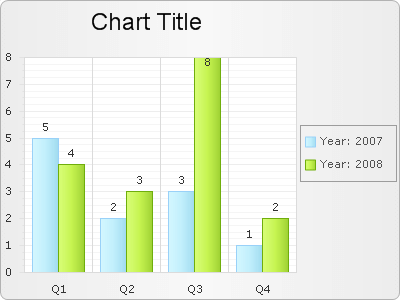

# Grouping databound items


>caution  **RadChart** has been replaced by[RadHtmlChart](http://www.telerik.com/products/aspnet-ajax/html-chart.aspx), Telerik's client-side charting component.	If you are considering **RadChart** for new development, examine the[RadHtmlChart documentation](ffd58685-7423-4c50-9554-f92c70a75138)and[online demos](http://demos.telerik.com/aspnet-ajax/htmlchart/examples/overview/defaultcs.aspx)first to see if it will fit your development needs.	If you are already using **RadChart** in your projects, you can migrate to **RadHtmlChart** by following these articles:[Migrating Series](2f393f28-bc31-459c-92aa-c3599785f6cc),[Migrating Axes](3f1bea81-87b9-4324-b0d2-d13131031048),[Migrating Date Axes](93226130-bc3c-4c53-862a-f9e17b2eb7dd),[Migrating Databinding](d6c5e2f1-280c-4fb0-b5b0-2f507697511d),[Feature parity](010dc716-ce38-480b-9157-572e0f140169).	Support for **RadChart** is discontinued as of **Q3 2014** , but the control will remain in the assembly so it can still be used.	We encourage you to use **RadHtmlChart** for new development.
>


## 

**DataGroupColumn** property defines the name of the column in
the underlying datasource which will be the criteria for grouping the chart
series items into series. There will be as many series as the number of
distinct values in this column. For each value there will be a ChartSeries in
the chart.

**GroupNameFormat** property defines a format for
the legend item when grouping is applied. This format can include
free text, which will be displayed in the legend items, as well as the
following two special words:

* **#NAME** - denotes the group column name

* **#VALUE** - denotes the group column value (it is the same for all the records shown in the same series)

Example:

Consider a chart populated from the following table:


>caption  

| Year | Quarter | Value |
| ------ | ------ | ------ |
|2007|Q1|5|
|2007|Q2|2|
|2007|Q3|3|
|2007|Q4|1|
|2008|Q1|4|
|2008|Q2|3|
|2008|Q3|8|
|2008|Q4|2|


Configure RadChart like this:


````C#
	     
	
	    RadChart1.DataGroupColumn = "Year";
	    RadChart1.PlotArea.XAxis.DataLabelsColumn = "Quarter";
	    RadChart1.Legend.Appearance.GroupNameFormat = "#NAME:
	    #VALUE";
				
````
````VB.NET
	     
	
	    RadChart1.DataGroupColumn = "Year"
	    RadChart1.PlotArea.XAxis.DataLabelsColumn = "Quarter"
	    RadChart1.Legend.Appearance.GroupNameFormat = "#NAME:
	    #VALUE"
				
````


This is the result:
>caption 




