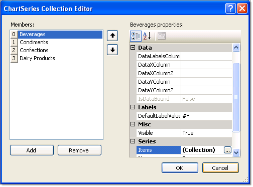
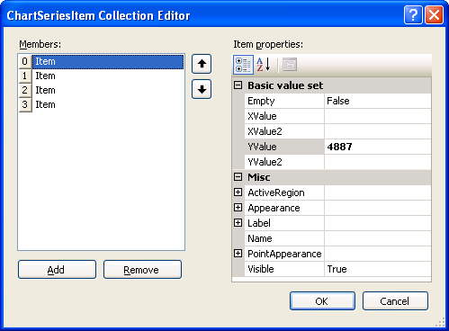
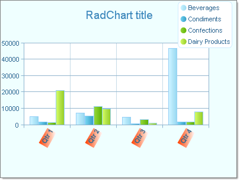

# Populate RadChart at Design-Time

>caution  **RadChart** has been replaced by[RadHtmlChart](http://www.telerik.com/products/aspnet-ajax/html-chart.aspx), Telerik's client-side charting component.	If you are considering **RadChart** for new development, examine the[RadHtmlChart documentation](ffd58685-7423-4c50-9554-f92c70a75138)and[online demos](http://demos.telerik.com/aspnet-ajax/htmlchart/examples/overview/defaultcs.aspx)first to see if it will fit your development needs.	If you are already using **RadChart** in your projects, you can migrate to **RadHtmlChart** by following these articles:[Migrating Series](2f393f28-bc31-459c-92aa-c3599785f6cc),[Migrating Axes](3f1bea81-87b9-4324-b0d2-d13131031048),[Migrating Date Axes](93226130-bc3c-4c53-862a-f9e17b2eb7dd),[Migrating Databinding](d6c5e2f1-280c-4fb0-b5b0-2f507697511d),[Feature parity](010dc716-ce38-480b-9157-572e0f140169).	Support for **RadChart** is discontinued as of **Q3 2014** , but the control will remain in the assembly so it can still be used.	We encourage you to use **RadHtmlChart** for new development.
>

## 

RadChart provides two collection editors: ChartSeries Collection Editor and ChartSeriesItem Collection Editor. They allow you to easily create series and items, and set the relevant properties without writing any code. 

There are two basic steps to populate the RadChart with data:

1. Click on the RadChart Series property ellipses to display the ChartSeries Collection Editor. Here you can add or remove series in the Members list box on the left side of the editor. You can set the series level properties by selecting a series member and editing properties in the properties window located on the right hand side of the editor. See topics [Series Overview](), [Series Items]() and [Series-Specific Properties]() for more information. Note the Items property under the Series property category.
>caption 

1. Click the Items property ellipses of a series to display the ChartSeriesItem Collection Editor**.** Here you can add or remove items in the Members list box on the left side of the editor.Select ChartSeriesItem objects in the Members list box on the left side of the editor. You can set item properties by selecting an item member and editing properties in the properties window located on the right hand side of the editor. Set the values for each item using the properties under the "Basic value set" property category. See [Series Items]() for more information.
>caption 

The running application shows ChartSeries members in the Legend and ChartSeriesItem as bars in the plot area.

>note This chart example also displays customization in the legend and axis labels. See[Legends]()and[Axis Labels]()for more information.
>

>caption 

# See Also

 * [Building RadCharts]()

 * [Creating RadChart Declaratively]()

 * [Creating RadChart Programmatically]()
