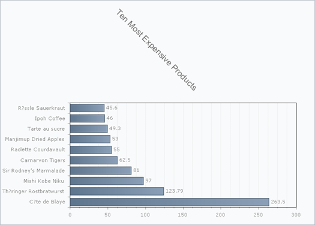

# AutoLayout

>caution  **RadChart** has been replaced by [RadHtmlChart](http://www.telerik.com/products/aspnet-ajax/html-chart.aspx), Telerik's client-side charting component. If you are considering **RadChart** for new development, examine the [RadHtmlChart documentation]() and [online demos](http://demos.telerik.com/aspnet-ajax/htmlchart/examples/overview/defaultcs.aspx) first to see if it will fit your development needs. If you are already using **RadChart** in your projects, you can migrate to **RadHtmlChart** by following these articles: [Migrating Series](), [Migrating Axes](), [Migrating Date Axes](), [Migrating Databinding](), [Features parity](). Support for **RadChart** is discontinued as of **Q3 2014**, but the control will remain in the assembly so it can still be used. We encourage you to use **RadHtmlChart** for new development.

The AutoLayout functionality instructs the control to perform layout arrangement automatically for optimal utilization of the whole chart area and ensures that all chart elements are fully readable and do not overlap with one another. To enable this feature set the RadChart **AutoLayout** to **True**.

````ASP.NET
<telerik:RadChart ID="RadChart1" runat="server" AutoLayout="true" SeriesOrientation="Horizontal">
</telerik:RadChart>
````

In the example below the Chart Title text block "Ten Most Expensive Products" is rotated to a 45 degree angle. Without **AutoLayout** enabled, the title would overlap other parts of the chart content. With **AutoLayout** enabled, the chart title is placed in an appropriately sized area. There is no need to adjust the margins of the chart elements manually in order to achieve the desired appearance. Also notice in the screenshot below how the chart with AutoLayout = False has has titles along the left cut off and that there is dead space along the right hand side (legend should be positioned there but it is hidden at the moment). In the screeshot with AutoScale = True, the axis item labels along the left are provided with enough space and the dead space along the right is removed.

## Example with AutoLayout = False


## Example with AutoLayout = True



The ASP.NET example code below produces the chart above with AutoScale enabled:

````ASP.NET
<telerik:RadChart ID="RadChart2" runat="server" DataSourceID="AccessDataSource1"
	Skin="WEbBlue" AutoLayout="true" Height="500px" Width="700px" SeriesOrientation="Horizontal">
	<Series>
		<telerik:ChartSeries DataYColumn="UnitPrice" Name="Product Unit Price">
		</telerik:ChartSeries>
	</Series>
	<PlotArea>
		<XAxis AutoScale="true">
			<Items>
				<telerik:ChartAxisItem TextBlock-Text="C?te de Blaye" />
				<telerik:ChartAxisItem TextBlock-Text="Th?ringer Rostbratwurst" />
				<telerik:ChartAxisItem TextBlock-Text="Mishi Kobe Niku" />
				<telerik:ChartAxisItem TextBlock-Text="Sir Rodney's Marmalade" />
				<telerik:ChartAxisItem TextBlock-Text="Carnarvon Tigers" />
				<telerik:ChartAxisItem TextBlock-Text="Raclette Courdavault" />
				<telerik:ChartAxisItem TextBlock-Text="Manjimup Dried Apples" />
				<telerik:ChartAxisItem TextBlock-Text="Tarte au sucre" />
				<telerik:ChartAxisItem TextBlock-Text="Ipoh Coffee" />
				<telerik:ChartAxisItem TextBlock-Text="R?ssle Sauerkraut" />
			</Items>
		</XAxis>
	</PlotArea>
	<ChartTitle>
		<Appearance RotationAngle="45">
		</Appearance>
		<TextBlock Text="Ten Most Expensive Products" />
	</ChartTitle>
	<Legend Appearance-Position-AlignedPosition="right" Visible="false"></Legend>
</telerik:RadChart>
````

There are limitations with this out-of-the-box functionality, however:

* User-specified margin values for chart elements are not taken into account.

* If you have enabled the AutoLayout feature - the supported **AlignedPosition** options for **Title** and **Legend** elements are **Top**, **Bottom**, **Left**, **Right** only.
