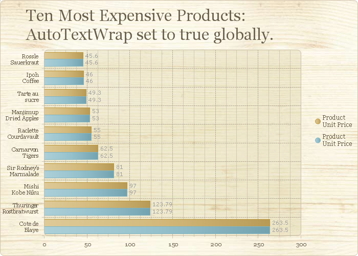
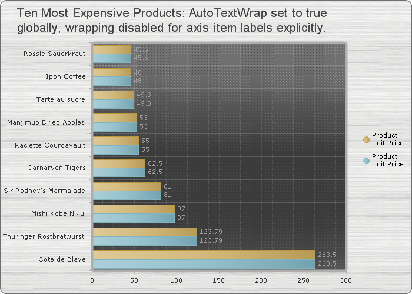
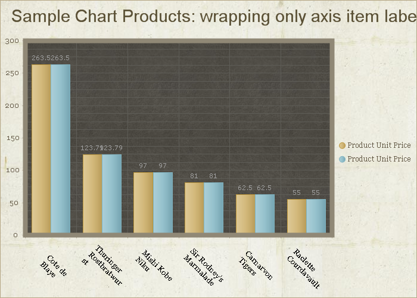

# Automatic Text-wrapping


>caution  __RadChart__ has been replaced by[RadHtmlChart](http://www.telerik.com/products/aspnet-ajax/html-chart.aspx), Telerik's client-side charting component.	If you are considering __RadChart__ for new development, examine the[RadHtmlChart documentation](ffd58685-7423-4c50-9554-f92c70a75138)and[online demos](http://demos.telerik.com/aspnet-ajax/htmlchart/examples/overview/defaultcs.aspx)first to see if it will fit your development needs.	If you are already using __RadChart__ in your projects, you can migrate to __RadHtmlChart__ by following these articles:[Migrating Series](2f393f28-bc31-459c-92aa-c3599785f6cc),[Migrating Axes](3f1bea81-87b9-4324-b0d2-d13131031048),[Migrating Date Axes](93226130-bc3c-4c53-862a-f9e17b2eb7dd),[Migrating Databinding](d6c5e2f1-280c-4fb0-b5b0-2f507697511d),[Feature parity](010dc716-ce38-480b-9157-572e0f140169).	Support for __RadChart__ is discontinued as of __Q3 2014__ , but the control will remain in the assembly so it can still be used.	We encourage you to use __RadHtmlChart__ for new development.
>


RadChart supports automatic Notepad-like word-wrapping functionality for the following text elements:

* Chart Title

* Chart Legend Item Labels

* Axis Item Labels

* Axis Labels

* MarkedZone Labels

* EmptySeriesMessage Label

* DataTable-related text elements


Automatic text-wrapping is disabled by default. The chart control provides fine-grained API that allows you to enable wrapping for all elements, or alternatively on individual element basis.

The behavior is controlled either via the __RadChart.AutoTextWrap__ property that enables text-wrapping globally for all supported chart elements, or you can set the AutoTextWrap properties for the respective chart elements. Setting a value for individual element always takes precedence i.e. you can have the global RadChart.AutoTextWrap property set to true, and still disable the text-wrapping for the title by setting its respective AutoTextWrap property to false.


AutoTextWrap properties that control the wrapping settings for individual elements (usually under Appearance on the respective TextBlock for each element):

* Chart Title (__ChartTitle.TextBlock.Appearance.AutoTextWrap__)

* Legend-related

* For all legend items (__Legend.Appearance.ItemTextAppearance.AutoTextWrap__)

* For individual legend item (__Legend -> Items -> LabelItem.TextBlock.Appearance.AutoTextWrap__)

* Axis-related

* For axis label (__Axis.AxisLabel.Appearance.AutoTextWrap__)

* For all axis item labels (__Axis.Appearance.TextAppearance.AutoTextWrap__)

* For individual axis item label (__Axis -> Items -> ChartAxisItem.TextBlock.AutoTextWrap__)

* DataTable text elements (__PlotArea.DataTable.Appearance.AutoTextWrap__)

* MarkedZone Labels (__ChartMarkedZone.Label.TextBlock.Appearance.AutoTextWrap__)

* EmptySeriesMessage (__PlotArea.EmptySeriesMessage.TextBlock.Appearance.AutoTextWrap__)


## Text-wrapping enabled for all chart elements:

````XML
	    <telerik:RadChart ID="RadChart1" runat="server" DataSourceID="AccessDataSource1"
	        AutoTextWrap="true" Skin="Wood" AutoLayout="true" Height="500px" Width="700px"
	        SeriesOrientation="Horizontal">
	        <Series>
	            <telerik:ChartSeries DataYColumn="UnitPrice" Name="Product Unit Price">
	            </telerik:ChartSeries>
	        </Series>
	        <Series>
	            <telerik:ChartSeries DataYColumn="UnitPrice" Name="Product Unit Price">
	            </telerik:ChartSeries>
	        </Series>
	        <PlotArea>
	            <XAxis AutoScale="false">
	                <Items>
	                    <telerik:ChartAxisItem TextBlock-Text="Cote de Blaye" />
	                    <telerik:ChartAxisItem TextBlock-Text="Thuringer Rostbratwurst" />
	                    <telerik:ChartAxisItem TextBlock-Text="Mishi Kobe Niku" />
	                    <telerik:ChartAxisItem TextBlock-Text="Sir Rodney's Marmalade" />
	                    <telerik:ChartAxisItem TextBlock-Text="Carnarvon Tigers" />
	                    <telerik:ChartAxisItem TextBlock-Text="Raclette Courdavault" />
	                    <telerik:ChartAxisItem TextBlock-Text="Manjimup Dried Apples" />
	                    <telerik:ChartAxisItem TextBlock-Text="Tarte au sucre" />
	                    <telerik:ChartAxisItem TextBlock-Text="Ipoh Coffee" />
	                    <telerik:ChartAxisItem TextBlock-Text="Rossle Sauerkraut" />
	                </Items>
	            </XAxis>
	        </PlotArea>
	        <ChartTitle>
	            <Appearance Dimensions-Margins="0,50,0,50">
	            </Appearance>
	            <TextBlock Text="Ten Most Expensive Products: AutoTextWrap set to true globally." />
	        </ChartTitle>
	    </telerik:RadChart>
	    <asp:AccessDataSource ID="AccessDataSource1" runat="server" DataFile="-/Nwind.mdb"
	        SelectCommand="SELECT * FROM [Ten Most Expensive Products]"></asp:AccessDataSource>
````


__Result:__
>caption 




## Text-wrapping enabled for all elements, but explicitly disabled for the axis item labels:

````XML
	    <telerik:RadChart ID="RadChart2" runat="server" DataSourceID="AccessDataSource1"
	        AutoTextWrap="true" Skin="Metal" AutoLayout="true" Height="500px" Width="700px"
	        SeriesOrientation="Horizontal">
	        <Series>
	            <telerik:ChartSeries DataYColumn="UnitPrice" Name="Product Unit Price">
	            </telerik:ChartSeries>
	        </Series>
	        <Series>
	            <telerik:ChartSeries DataYColumn="UnitPrice" Name="Product Unit Price">
	            </telerik:ChartSeries>
	        </Series>
	        <PlotArea>
	            <XAxis AutoScale="false">
	                <Appearance TextAppearance-AutoTextWrap="false">
	                </Appearance>
	                <Items>
	                    <telerik:ChartAxisItem TextBlock-Text="Cote de Blaye" />
	                    <telerik:ChartAxisItem TextBlock-Text="Thuringer Rostbratwurst" />
	                    <telerik:ChartAxisItem TextBlock-Text="Mishi Kobe Niku" />
	                    <telerik:ChartAxisItem TextBlock-Text="Sir Rodney's Marmalade" />
	                    <telerik:ChartAxisItem TextBlock-Text="Carnarvon Tigers" />
	                    <telerik:ChartAxisItem TextBlock-Text="Raclette Courdavault" />
	                    <telerik:ChartAxisItem TextBlock-Text="Manjimup Dried Apples" />
	                    <telerik:ChartAxisItem TextBlock-Text="Tarte au sucre" />
	                    <telerik:ChartAxisItem TextBlock-Text="Ipoh Coffee" />
	                    <telerik:ChartAxisItem TextBlock-Text="Rossle Sauerkraut" />
	                </Items>
	            </XAxis>
	        </PlotArea>
	        <ChartTitle>
	            <Appearance Dimensions-Margins="0,50,0,50">
	            </Appearance>
	            <TextBlock Text="Ten Most Expensive Products: AutoTextWrap set to true globally, wrapping disabled for axis item labels explicitly." />
	        </ChartTitle>
	    </telerik:RadChart>
	    <asp:AccessDataSource ID="AccessDataSource1" runat="server" DataFile="-/Nwind.mdb"
	        SelectCommand="SELECT * FROM [Ten Most Expensive Products]"></asp:AccessDataSource>
````


__Result:__
>caption 




## Text-wrapping enabled only for the axis item labels explicitly:

````XML
	    <telerik:RadChart ID="RadChart3" runat="server" DataSourceID="AccessDataSource1"
	        Skin="Marble" AutoLayout="true" Height="500px" Width="700px" SeriesOrientation="Vertical">
	        <Series>
	            <telerik:ChartSeries DataYColumn="UnitPrice" Name="Product Unit Price">
	            </telerik:ChartSeries>
	        </Series>
	        <Series>
	            <telerik:ChartSeries DataYColumn="UnitPrice" Name="Product Unit Price">
	            </telerik:ChartSeries>
	        </Series>
	        <PlotArea DataTable-Visible="false">
	            <XAxis AutoScale="false">
	                <Appearance TextAppearance-TextProperties-Color="Black">
	                    <TextAppearance AutoTextWrap="true" TextProperties-Font="Georgia, 10pt">
	                    </TextAppearance>
	                    <LabelAppearance Position-AlignedPosition="Left" RotationAngle="45">
	                    </LabelAppearance>
	                </Appearance>
	                <Items>
	                    <telerik:ChartAxisItem TextBlock-Text="Cote de Blaye" />
	                    <telerik:ChartAxisItem TextBlock-Text="Thuringer Rostbratwurst" />
	                    <telerik:ChartAxisItem TextBlock-Text="Mishi Kobe Niku" />
	                    <telerik:ChartAxisItem TextBlock-Text="Sir Rodney's Marmalade" />
	                    <telerik:ChartAxisItem TextBlock-Text="Carnarvon Tigers" />
	                    <telerik:ChartAxisItem TextBlock-Text="Raclette Courdavault" />
	                </Items>
	            </XAxis>
	        </PlotArea>
	        <ChartTitle>
	            <TextBlock Text="Sample Chart Products: wrapping only axis item labels." />
	        </ChartTitle>
	    </telerik:RadChart>
	    <asp:AccessDataSource ID="AccessDataSource1" runat="server" DataFile="-/Nwind.mdb"
	        SelectCommand="SELECT * FROM [Ten Most Expensive Products]"></asp:AccessDataSource>
````


__Result:__
>caption 


