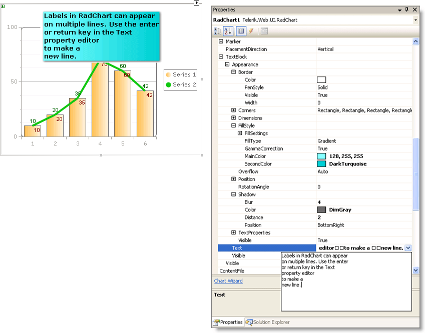

# Multi-Line Labels

>caution **RadChart** has been deprecated since Q3 2014 and is marked as obsolete as of the 2026 Q2 SP1 (v2026.2.708) release. This is the last release that includes the RadChart component — its source code will be removed from the assembly in the next release. We strongly recommend using [RadHtmlChart](https://www.telerik.com/products/aspnet-ajax/html-chart.aspx), Telerik's modern client-side charting component. 
>To transition from RadChart to RadHtmlChart, refer to the following migration articles:
> - [Migrating Series]()
> - [Migrating Axes]()
> - [Migrating Date Axes]()
> - [Migrating Databinding]()
> - [Features parity]()
>Explore the [RadHtmlChart documentation]() and online demos to determine how it fits your development needs.

Labels in RadChart can appear on multiple lines. The property editor for **TextBlock**.**Text** properties allows you to hit the enter key to start a new line. Press control-enter to accept the text and close the property editor.

