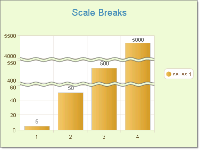

# Scale Breaks

>caution  **RadChart** has been replaced by [RadHtmlChart](https://www.telerik.com/products/aspnet-ajax/html-chart.aspx), Telerik's client-side charting component. If you are considering **RadChart** for new development, examine the [RadHtmlChart documentation]() and [online demos](https://demos.telerik.com/aspnet-ajax/htmlchart/examples/overview/defaultcs.aspx) first to see if it will fit your development needs. If you are already using **RadChart** in your projects, you can migrate to **RadHtmlChart** by following these articles: [Migrating Series](), [Migrating Axes](), [Migrating Date Axes](), [Migrating Databinding](), [Features parity](). Support for **RadChart** is discontinued as of **Q3 2014**, but the control will remain in the assembly so it can still be used. We encourage you to use **RadHtmlChart** for new development.

The ScaleBreaks feature allows you to "break off" large chunks of the axis so that graphs with large amplitude are easier to read. ScaleBreaks are available for both YAxis and YAxis2 of the plot area. You can tailor the maximum number of breaks, the minimum interval between data points before a break can occur, the visual size of the breaks and the visual style of the breaks.

