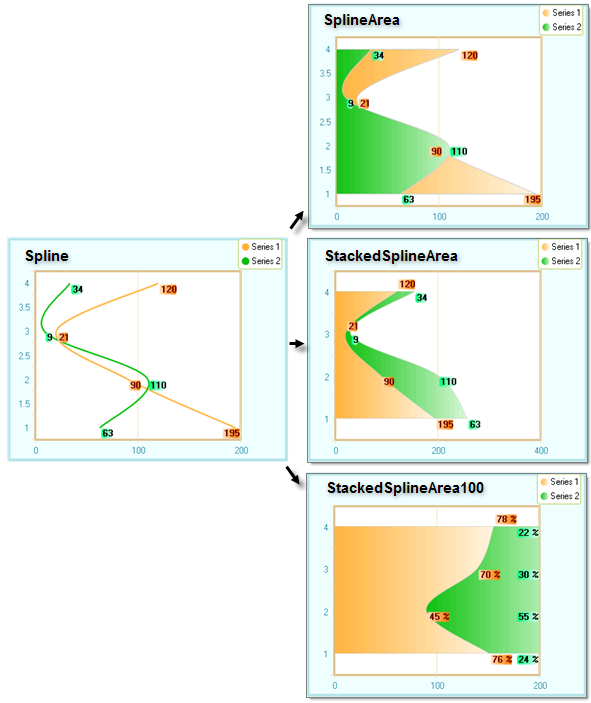

# Spline Areas

>caution  **RadChart** has been replaced by [RadHtmlChart](https://www.telerik.com/products/aspnet-ajax/html-chart.aspx), Telerik's client-side charting component. If you are considering **RadChart** for new development, examine the [RadHtmlChart documentation]() and [online demos](https://demos.telerik.com/aspnet-ajax/htmlchart/examples/overview/defaultcs.aspx) first to see if it will fit your development needs. If you are already using **RadChart** in your projects, you can migrate to **RadHtmlChart** by following these articles: [Migrating Series](), [Migrating Axes](), [Migrating Date Axes](), [Migrating Databinding](), [Features parity](). Support for **RadChart** is discontinued as of **Q3 2014**, but the control will remain in the assembly so it can still be used. We encourage you to use **RadHtmlChart** for new development.

The new Spline Area Charts take the Spline chart a step further.Like the Spline, the Spline Area takes a limited set of known data points and interpolates the intervening values.Then the area defined by the spline curve is filled in. You define one or more series of chart items, set the chart type to **SplineArea, SplineStackedArea or StackedSplineArea100** and RadChart does the rest.

You can see how the same data is presented using the new chart types. **SplineArea** displays from the back to the front, starting with the first series. **StackedSplineArea** adds each area to the next without covering previous areas. **StackedSplineArea100** shows each area as a percentage contributing to the whole of a category.

