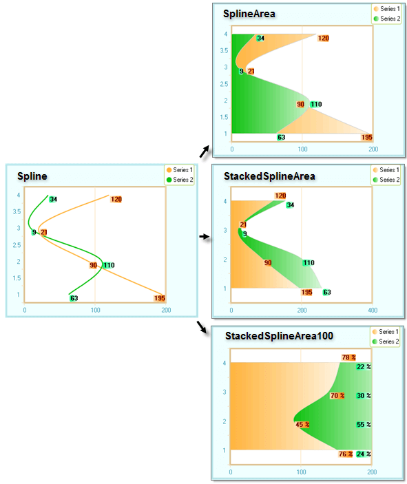

# Spline Areas

>caution **RadChart** has been deprecated since Q3 2014 and is marked as obsolete as of the 2026 Q2 SP1 (v2026.2.708) release. This is the last release that includes the RadChart component — its source code will be removed from the assembly in the next release. We strongly recommend using [RadHtmlChart](https://www.telerik.com/products/aspnet-ajax/html-chart.aspx), Telerik's modern client-side charting component. 
>To transition from RadChart to RadHtmlChart, refer to the following migration articles:
> - [Migrating Series]()
> - [Migrating Axes]()
> - [Migrating Date Axes]()
> - [Migrating Databinding]()
> - [Features parity]()
>Explore the [RadHtmlChart documentation]() and online demos to determine how it fits your development needs.

The new Spline Area Charts take the Spline chart a step further.Like the Spline, the Spline Area takes a limited set of known data points and interpolates the intervening values.Then the area defined by the spline curve is filled in. You define one or more series of chart items, set the chart type to **SplineArea, SplineStackedArea or StackedSplineArea100** and RadChart does the rest.

You can see how the same data is presented using the new chart types. **SplineArea** displays from the back to the front, starting with the first series. **StackedSplineArea** adds each area to the next without covering previous areas. **StackedSplineArea100** shows each area as a percentage contributing to the whole of a category.

