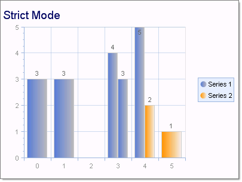

# Strict Mode

>caution  **RadChart** has been replaced by [RadHtmlChart](https://www.telerik.com/products/aspnet-ajax/html-chart.aspx), Telerik's client-side charting component. If you are considering **RadChart** for new development, examine the [RadHtmlChart documentation]() and [online demos](https://demos.telerik.com/aspnet-ajax/htmlchart/examples/overview/defaultcs.aspx) first to see if it will fit your development needs. If you are already using **RadChart** in your projects, you can migrate to **RadHtmlChart** by following these articles: [Migrating Series](), [Migrating Axes](), [Migrating Date Axes](), [Migrating Databinding](), [Features parity](). Support for **RadChart** is discontinued as of **Q3 2014**, but the control will remain in the assembly so it can still be used. We encourage you to use **RadHtmlChart** for new development.

The RadChart bar series now features "strict mode". This is not a property or setting, but a behavior of bar chart series where X values are respected and bars are positioned according to their XValues. If there are no series items with XValues then RadChart resumes standard sequential ordering of each item. The screen shot above was produced using the following X and Y values:

**Series 1**

|  **YValue**  |  **XValue**  |
| ------ | ------ |
|3|0|
|3|1|
|4|3|
|3|3|
|5|4|

**Series 2**

|  **YValue**  |  **XValue**  |
| ------ | ------ |
|1|5|
|2|4|
