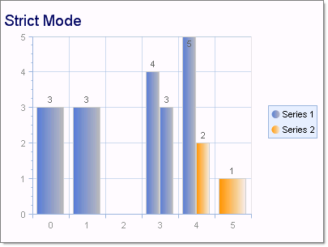

# Strict Mode

>caution **RadChart** has been deprecated since Q3 2014 and is marked as obsolete as of the 2026 Q2 SP1 (v2026.2.708) release. This is the last release that includes the RadChart component — its source code will be removed from the assembly in the next release. We strongly recommend using [RadHtmlChart](https://www.telerik.com/products/aspnet-ajax/html-chart.aspx), Telerik's modern client-side charting component. 
>To transition from RadChart to RadHtmlChart, refer to the following migration articles:
> - [Migrating Series]()
> - [Migrating Axes]()
> - [Migrating Date Axes]()
> - [Migrating Databinding]()
> - [Features parity]()
>Explore the [RadHtmlChart documentation]() and online demos to determine how it fits your development needs.

The RadChart bar series now features "strict mode". This is not a property or setting, but a behavior of bar chart series where X values are respected and bars are positioned according to their XValues. If there are no series items with XValues then RadChart resumes standard sequential ordering of each item. The screen shot above was produced using the following X and Y values:

**Series 1**

|  **YValue**  |  **XValue**  |
| ------ | ------ |
|3|0|
|3|1|
|4|3|
|3|3|
|5|4|

**Series 2**

|  **YValue**  |  **XValue**  |
| ------ | ------ |
|1|5|
|2|4|
