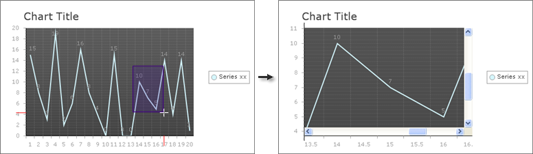
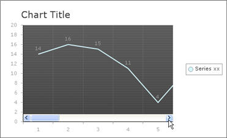

# Zooming and Scrolling

>caution  **RadChart** has been replaced by[RadHtmlChart](http://www.telerik.com/products/aspnet-ajax/html-chart.aspx), Telerik's client-side charting component.	If you are considering **RadChart** for new development, examine the[RadHtmlChart documentation](ffd58685-7423-4c50-9554-f92c70a75138)and[online demos](http://demos.telerik.com/aspnet-ajax/htmlchart/examples/overview/defaultcs.aspx)first to see if it will fit your development needs.	If you are already using **RadChart** in your projects, you can migrate to **RadHtmlChart** by following these articles:[Migrating Series](2f393f28-bc31-459c-92aa-c3599785f6cc),[Migrating Axes](3f1bea81-87b9-4324-b0d2-d13131031048),[Migrating Date Axes](93226130-bc3c-4c53-862a-f9e17b2eb7dd),[Migrating Databinding](d6c5e2f1-280c-4fb0-b5b0-2f507697511d),[Feature parity](010dc716-ce38-480b-9157-572e0f140169).	Support for **RadChart** is discontinued as of **Q3 2014** , but the control will remain in the assembly so it can still be used.	We encourage you to use **RadHtmlChart** for new development.

The zooming and scrolling feature enables the user to zoom into an area of the chart so the data is shown in greater detail. For performance reasons only the visible image chunk is requested from the server-side. However, the user can scroll into view other parts of the chart data and the requested image chunks are automatically loaded via ASP.NET 2.0 callback requests on the fly.

The user can perform the zooming either manually or programmatically:

* Manual zoom is performed by dragging a rectangle area over the chart with the mouse. This rectangle is exactly the area that will be shown in the [Plot Area](). Zooming, by default, performs regular postbacks but can be wrapped within a MS UpdatePanel or Telerik RadAjaxPanel and zooming works seamlessly using AJAX calls.

* You can programmatically change the zooming factor on the server-side via the **RadChart.ClientSettings.XScale** and **RadChart.ClientSettings.YScale** properties. These two properties hold the scaling factor for the XAxis and YAxis respectively.

* You can programmatically change the scrolled position on the server-side via the **RadChart.ClientSettings.XScrollOffset** and **RadChart.ClientSettings.YScrollOffset** properties. Note that the offset properties accept numeric values between 0 and 1 where the(XScrollOffset=0, YScrollOffset=0) pair represents the top-left corner and the (XScrollOffset=1, YScrollOffset=1) pair represents the bottom-right corner of the plotArea.

>note You can find the description of the zooming / scrolling client-side API [here]().

>caution The zoom and scroll features of RadChart require session state usage.

Zooming and Scrolling are disabled by default. Enable zooming / scrolling by setting the **RadChart.ClientSettings.ScrollMode** property to a value other than **None.** The available ScrollMode values are **None**, **XOnly**, **YOnly** and **Both**. The example below allows the user to scroll along either axis and zoom. The screenshot below shows the cursor selecting an area of the chart with values 10, 7 and 5. Once the area is selected that chunk is displayed in the image on the right.



````ASP.NET
<telerik:radchart id="RadChart1" runat="Server" width="495px">
   <clientsettings scrollmode="Both" />
   <Series>
	   <telerik:ChartSeries DataYColumn="MyColumn" Type="Line">
	   </telerik:ChartSeries>
   </Series>
</telerik:radchart>
````

You can also use scrolling alone by explicitly disabling manual client-side zooming (**RadChart.ClientSettings.EnableZoom** = **False**). You can still provide XScale and YScale values on the server-side. For example, the markup below allows the user to see a chart that is scaled by 4, can scroll along the X Axis, but cannot zoom.

The screenshot shows that the user can scroll to see more of the chart. When the "chunks" of the chart are first retrieved, a progress indicator displays until the image is redrawn. Once the chunks are loaded in, scrolling becomes nearly instantaneous.



````ASP.NET
<telerik:RadChart ID="RadChart2" runat="Server" Width="495px">
   <ClientSettings EnableZoom="false" ScrollMode="XOnly" XScale="4" />
   <Series>
	   <telerik:ChartSeries DataYColumn="MyColumn" Type="Line">
	   </telerik:ChartSeries>
   </Series>
</telerik:RadChart> 
````

All properties related to the scrolling and zooming feature are grouped within the RadChart.**ClientSettings** complex property:

* You can enable / disable the axis markers via the **EnableAxisMarkers** property.

* You can customize the axis marker appearance via the **AxisMarkersColor / AxisMarkersSize** properties.

* You can customize the zoom rectangle appearance via the **ZoomRectangleColor / ZoomRectangleOpacity** properties.

>note Zooming and Scrolling are available for the RadChart for ASP.NET AJAX product only.


