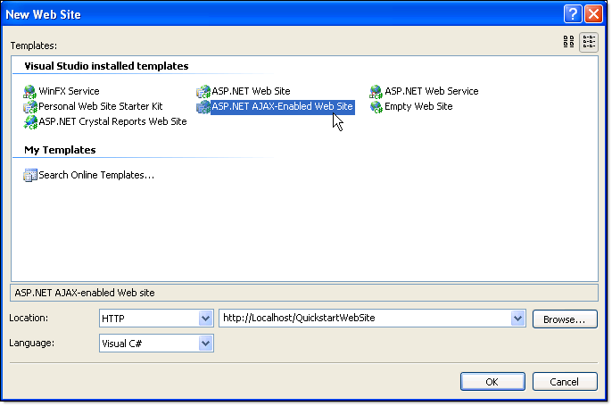
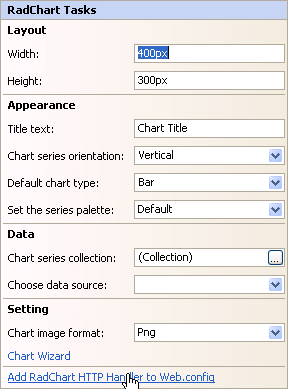

# Create a Bar Chart with Simple Static Data

>caution  **RadChart** has been replaced by [RadHtmlChart](http://www.telerik.com/products/aspnet-ajax/html-chart.aspx), Telerik's client-side charting component.	If you are considering **RadChart** for new development, examine the [RadHtmlChart documentation](ffd58685-7423-4c50-9554-f92c70a75138) and [online demos](http://demos.telerik.com/aspnet-ajax/htmlchart/examples/overview/defaultcs.aspx) first to see if it will fit your development needs.	If you are already using **RadChart** in your projects, you can migrate to **RadHtmlChart** by following these articles:[Migrating Series](2f393f28-bc31-459c-92aa-c3599785f6cc),[Migrating Axes](3f1bea81-87b9-4324-b0d2-d13131031048),[Migrating Date Axes](93226130-bc3c-4c53-862a-f9e17b2eb7dd),[Migrating Databinding](d6c5e2f1-280c-4fb0-b5b0-2f507697511d),[Feature parity](010dc716-ce38-480b-9157-572e0f140169).	Support for **RadChart** is discontinued as of **Q3 2014** , but the control will remain in the assembly so it can still be used.	We encourage you to use **RadHtmlChart** for new development.

This Quick Start tutorial is designed to have you quickly up and running with a working RadChart application. In the process of creating a basic bar chart you will be introduced to some of the features of RadChart. You will populate the chart with static data and modify several properties that affect chart appearance.

## Create an ASP.NET AJAX Web Application

1. From the Visual Studio File menu select New | Project.

1. Select the "ASP.NET AJAX-Enabled Web Application" and enter a name and location path.

	

	>tip While its possible to get a regular ASP.NET Web Application working with RadChart, the ASP.NET AJAX-Enabled projects automatically provide you with an appropriate web.config file, a ScriptManager component and the required references for ASP.NET AJAX.

1. From the Toolbox drag a RadChart component to the default web page.

1. RadChart requires that you register an HTTP handler in the web config file to render the chart. To do this, click the **Smart Tag Add RadChart HTTP Handler to Web.Config**.

	

## Populate Chart Data

1. Click the RadChart's SmartTag

1. From the SmartTag "Data" section, click the ellipses for the Chart Series Collection.

1. Click "Series 1" in the members list on the left, then locate the Name property in the property window. 

1. Change the Name property to "Sales" and the DefaultLabelValue to "#ITEM". Name will be the series name that shows up in the legend. DefaultLabelValue will display the name of each item in the series instead of the item value.

1. Locate the Items property in the property window.

1. Click the ellipses button of the Items property to open the ChartSeriesItem Collection Editor.

1. Click the Add button to add a new Item.

1. In the property window for the new item, change the Name property to "Beverages".

1. Change the YValue property to "10000".

	

1. Repeat the Add Item steps to add 3 new items.

1. Replace the properties for the three new items as follows
	* Label=Produce, YValue =7500
	* Label=Poultry, YValue =9000
	* Label=Grains, YValue =11200

1. Click OK to close the ChartSeriesItem Collection Editor.

1. Click "Series 2" in the ChartSeries Collection Editor.

1. Click the Remove button to remove Series 2.

1. Click the OK button to close the ChartSeries Collection Editor.

1. The chart will display the new data using the default formatting.

	

## Format the Chart

1. Click the Chart Wizard link at the bottom of the RadChart Tasks menu.

1. Click the Axis Tab.

1. Locate the Visual Properties section of the Axis tab.

1. On the Select Axis drop down list select the X Axis. In the Axis Title entry enter "Product Categories". Un-check Show Ticks to remove the tick marks from the bottom of the chart. 

1. On the Select Axis drop down list select the Y Axis. Un-check Show Ticks to remove the tick marks on the left hand side of the chart.

	

1. Click the Labels, Legend and Title tab

1. Locate the Legend section.

1. Uncheck the Visible check box. This will remove the Sales legend from the right side of the graph.

	

1. On the Skins tab select the Deep Blue skin.

	

1. Click the Submit button to close the wizard.

1. In the properties window, locate PlotArea.XAxis.AxisLabel.TextBlock.Visible and set it to "True".

	

1. Set AutoLayoutproperty to "True".

1. Run the application to view the finished chart. It should look like the screen shot shown below.

	