# Create a Data Bound Chart

>caution  **RadChart** has been replaced by [RadHtmlChart](http://www.telerik.com/products/aspnet-ajax/html-chart.aspx), Telerik's client-side charting component. If you are considering **RadChart** for new development, examine the [RadHtmlChart documentation]() and [online demos](http://demos.telerik.com/aspnet-ajax/htmlchart/examples/overview/defaultcs.aspx) first to see if it will fit your development needs. If you are already using **RadChart** in your projects, you can migrate to **RadHtmlChart** by following these articles: [Migrating Series](), [Migrating Axes](), [Migrating Date Axes](), [Migrating Databinding](), [Features parity](). Support for **RadChart** is discontinued as of **Q3 2014**, but the control will remain in the assembly so it can still be used. We encourage you to use **RadHtmlChart** for new development.

This Quick Start tutorial is designed to have you quickly up and running with a working data bound RadChart. In the tutorial you will populate the chart by binding to a data source and will modify several properties that affect chart appearance.

## Create an ASP.NET AJAX Web Application

1. From the Visual Studio File menu select New | Project.

1. Select the "ASP.NET AJAX-Enabled Web Application" and enter a name and location path.

	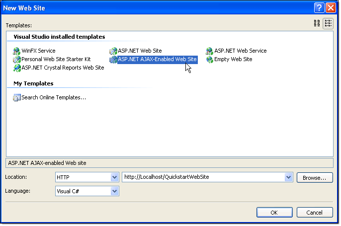

	>tip While its possible to get a regular ASP.NET Web Application working with RadChart, the ASP.NET AJAX-Enabled projects automatically provide you with an appropriate web.config file, a ScriptManager component and the required references for ASP.NET AJAX.

1. From the Toolbox drag a RadChart component to the default web page.

1. RadChart requires that you register an HTTP handler in the web config file to render the chart. To do this, click the **Smart Tag Add RadChart HTTP Handler to Web.Config**.

	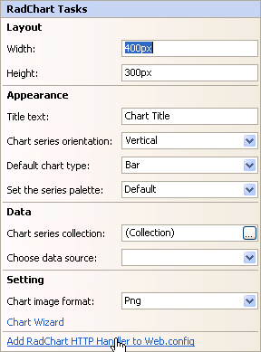

## Configuring the Data Source

1. These steps demonstrate configuring a data source for RadChart. It uses the AdventureWorksT MS SQL database that installs with Telerik controls. To begin configuring a RadChart data source select "New data source ..." from the Data section of the Smart Tag menu

	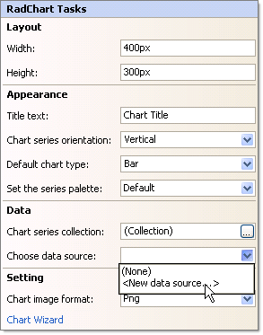

1. On the Data Source Configuration Wizard page select Database and click the Next button.

	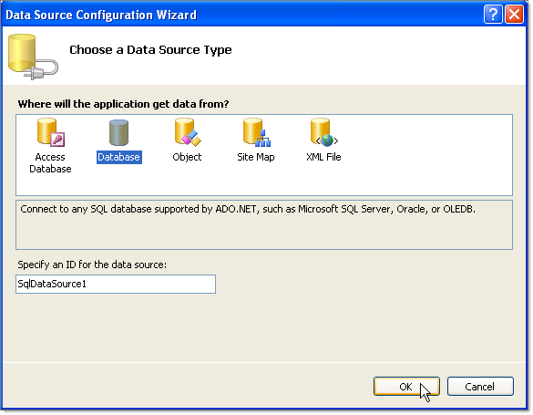

1. On the Choose Your Data Connection page click the New Connection button. This will display the Add Connection. Enter "(local)\SQLEXPRESS" in the Server name drop down list. Select "AdventureWorksT" from the Select or enter a database name drop down list. Optionally, you can click the Test Connection button to verify your settings so far. Click the OK button to close the dialog.

	

1. On the Choose Your Data Connection page of the wizard click the Next button.

	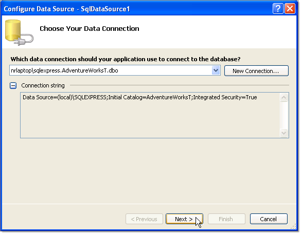

1. On the Configure the Select Statement click the Specify a custom SQL Statement or stored procedure radio button. Click the Next button.

	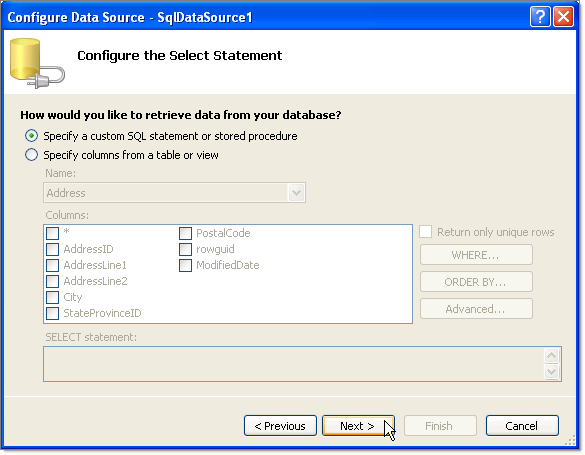

1. In the Define Custom Statements or Stored Procedures enter the following SQL.

	__SQL__

		SELECT Top 10 Production.ProductSubcategory.NAME AS [SubCategory], SUM(Production.ProductInventory.Quantity) AS [Total Quantity] FROM Production.Product INNER JOIN Production.ProductSubcategory ON Production.Product.ProductSubcategoryID = Production.ProductSubcategory.ProductSubcategoryID INNER JOIN Production.ProductInventory ON Production.Product.ProductID = Production.ProductInventory.ProductID GROUP BY Production.ProductSubcategory.NAME ORDER BY SUM(Production.ProductInventory.Quantity) DESC

1. Click the Next button.

	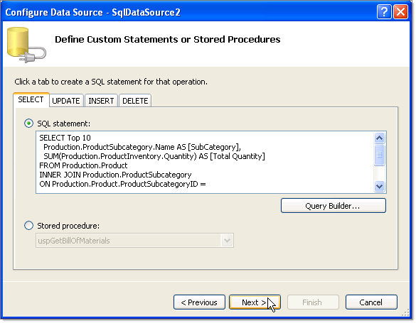

1. Click the Test Query to see the data that will be displayed in the chart. Click the Finish button to close the wizard.

	

The chart should look similar to the screenshot below:

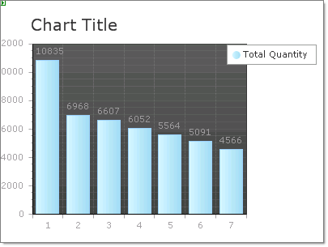

## Change the way RadChart Visualizes using the RadChart Wizard

1. From the Smart Tag select the RadChart Wizard. Select the Type tab and click the Horizontal Orientation radio button

	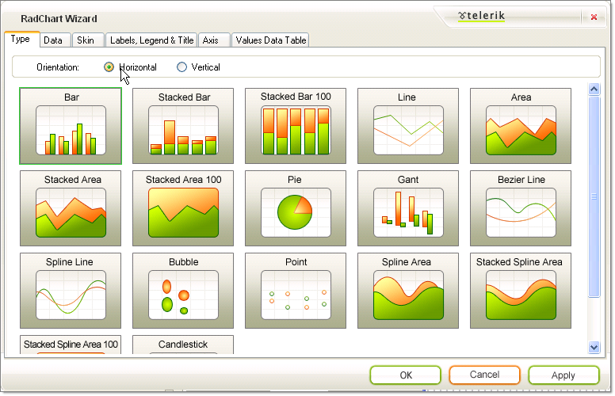

1. On the RadChart Wizard Data tab Axis Labels choose the "SubCategory" from the X-Axis drop down.

	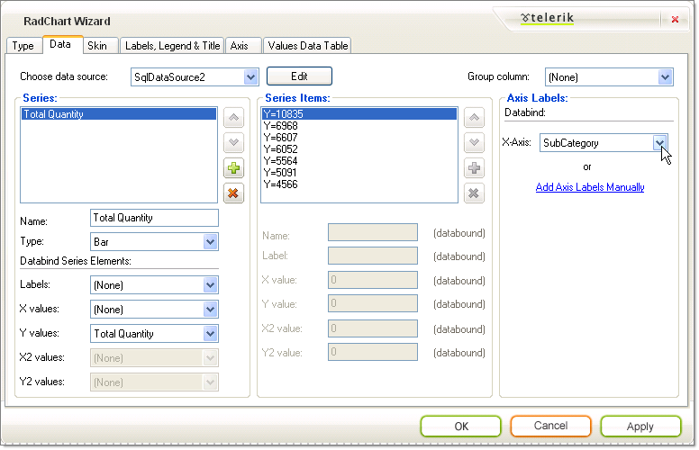

1. On the RadChart Wizard Skin tab select the "Deep Blue" skin.

	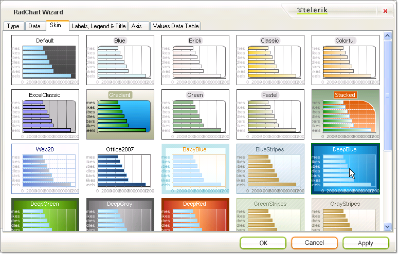

1. On the RadChart Wizard Labels, Legend and Title set the Legend Alignment to "Right" and Title Text to "Products".

	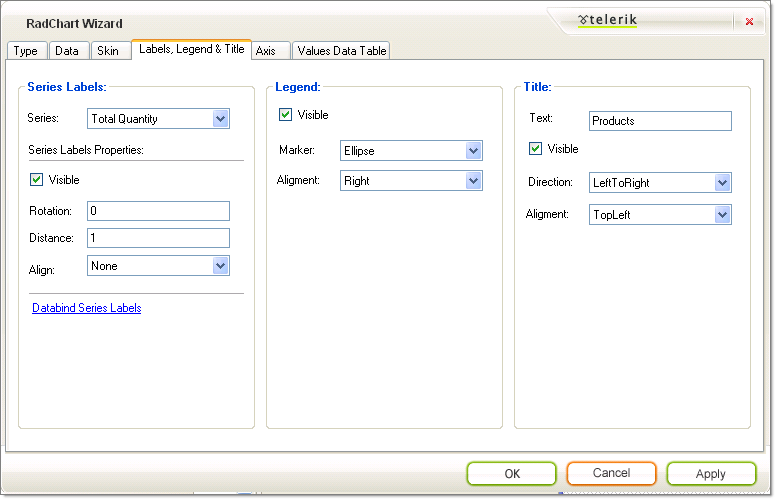

1. The X-Axis labels bound to the "SubCategory" column are too wide and will overflow. To make the plot area smaller to make room, set the PlotArea.Appearance.Dimensions.Margins.Left to "50%".

	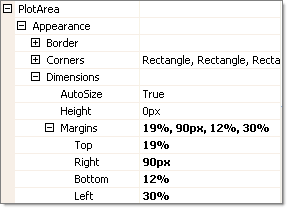

1. The finished chart should look like the screenshot below.

	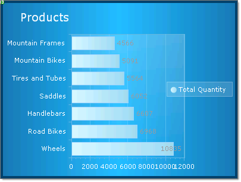