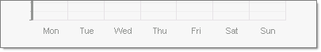

# How to Add Axis Labels Programmatically

>caution  **RadChart** has been replaced by [RadHtmlChart](http://www.telerik.com/products/aspnet-ajax/html-chart.aspx), Telerik's client-side charting component. If you are considering **RadChart** for new development, examine the [RadHtmlChart documentation]() and [online demos](http://demos.telerik.com/aspnet-ajax/htmlchart/examples/overview/defaultcs.aspx) first to see if it will fit your development needs. If you are already using **RadChart** in your projects, you can migrate to **RadHtmlChart** by following these articles: [Migrating Series](), [Migrating Axes](), [Migrating Date Axes](), [Migrating Databinding](), [Features parity](). Support for **RadChart** is discontinued as of **Q3 2014**, but the control will remain in the assembly so it can still be used. We encourage you to use **RadHtmlChart** for new development.

To add labels along an Axis programmatically:


* Set AutoScale to false.


* Add a range of items to the axis.


* Populate the Items.




````C#
radChart.PlotArea.XAxis.AutoScale = false;
radChart.PlotArea.XAxis.AddRange(1, 7, 1); 
radChart.PlotArea.XAxis[0].TextBlock.Text = "Mon";
radChart.PlotArea.XAxis[1].TextBlock.Text = "Tue";
radChart.PlotArea.XAxis[2].TextBlock.Text = "Wed";
radChart.PlotArea.XAxis[3].TextBlock.Text = "Thu";
radChart.PlotArea.XAxis[4].TextBlock.Text = "Fri";
radChart.PlotArea.XAxis[5].TextBlock.Text = "Sat";
radChart.PlotArea.XAxis[6].TextBlock.Text = "Sun";
````
````VB
radChart.PlotArea.XAxis.AutoScale = False
radChart.PlotArea.XAxis.AddRange(1, 7, 1)
radChart.PlotArea.XAxis(0).TextBlock.Text = "Mon"
radChart.PlotArea.XAxis(1).TextBlock.Text = "Tue"
radChart.PlotArea.XAxis(2).TextBlock.Text = "Wed"
radChart.PlotArea.XAxis(3).TextBlock.Text = "Thu"
radChart.PlotArea.XAxis(4).TextBlock.Text = "Fri"
radChart.PlotArea.XAxis(5).TextBlock.Text = "Sat"
radChart.PlotArea.XAxis(6).TextBlock.Text = "Sun"
````

