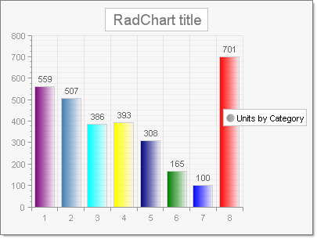

# How to Assign Individual Colors to Bars

>caution  **RadChart** has been replaced by [RadHtmlChart](http://www.telerik.com/products/aspnet-ajax/html-chart.aspx), Telerik's client-side charting component.	If you are considering **RadChart** for new development, examine the [RadHtmlChart documentation](ffd58685-7423-4c50-9554-f92c70a75138) and [online demos](http://demos.telerik.com/aspnet-ajax/htmlchart/examples/overview/defaultcs.aspx) first to see if it will fit your development needs.	If you are already using **RadChart** in your projects, you can migrate to **RadHtmlChart** by following these articles:[Migrating Series](2f393f28-bc31-459c-92aa-c3599785f6cc),[Migrating Axes](3f1bea81-87b9-4324-b0d2-d13131031048),[Migrating Date Axes](93226130-bc3c-4c53-862a-f9e17b2eb7dd),[Migrating Databinding](d6c5e2f1-280c-4fb0-b5b0-2f507697511d),[Feature parity](010dc716-ce38-480b-9157-572e0f140169).	Support for **RadChart** is discontinued as of **Q3 2014** , but the control will remain in the assembly so it can still be used.	We encourage you to use **RadHtmlChart** for new development.

"I need each bar in a bar chart to be a different color. How do I do this?"

By default RadChart is designed so that all bars from a series have the same colors. If you need each to have a different color, loop through each chart series item and assign them a color from an array. This should be done after binding the chart, so the chart series items are available.





````C#
protected void Page_Load(object sender, EventArgs e)
{
   Color[] barColors = new Color[8]{
       Color.Purple,
       Color.SteelBlue,
       Color.Aqua,
       Color.Yellow,
       Color.Navy,
       Color.Green,
       Color.Blue,
       Color.Red
   };
    if (!IsPostBack)
    {
        int i = 0;
        RadChart1.DataSourceID = "SqlDataSource1";
        RadChart1.DataBind();
        RadChart1.Series[0].Name = "Units by Category";
        foreach (ChartSeriesItem item in RadChart1.Series[0].Items)
        {
            item.Appearance.FillStyle.MainColor = barColors[i++];
        }
    }
}
````
````VB
Protected Sub Page_Load(ByVal sender As Object, ByVal e As EventArgs)
    Dim barColors As Color() = New Color(8) {Color.Purple, Color.SteelBlue, Color.Aqua, Color.Yellow, Color.Navy, Color.Green, _
     Color.Blue, Color.Red}
    If Not IsPostBack Then
        Dim i As Integer = 0
        RadChart1.DataSourceID = "SqlDataSource1"
        RadChart1.DataBind()
        RadChart1.Series(0).Name = "Units by Category"
        For Each item As ChartSeriesItem In RadChart1.Series(0).Items
            item.Appearance.FillStyle.MainColor = barColors(System.Math.Max(System.Threading.Interlocked.Increment(i), i - 1))
        Next
    End If
End Sub
````

