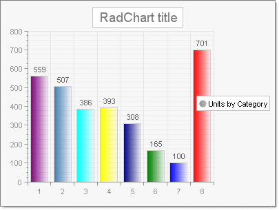

# How to Assign Individual Colors to Bars

>caution **RadChart** has been deprecated since Q3 2014 and is marked as obsolete as of the 2026 Q2 SP1 (v2026.2.708) release. This is the last release that includes the RadChart component — its source code will be removed from the assembly in the next release. We strongly recommend using [RadHtmlChart](https://www.telerik.com/products/aspnet-ajax/html-chart.aspx), Telerik's modern client-side charting component. 
>To transition from RadChart to RadHtmlChart, refer to the following migration articles:
> - [Migrating Series]()
> - [Migrating Axes]()
> - [Migrating Date Axes]()
> - [Migrating Databinding]()
> - [Features parity]()
>Explore the [RadHtmlChart documentation]() and online demos to determine how it fits your development needs.

"I need each bar in a bar chart to be a different color. How do I do this?"

By default RadChart is designed so that all bars from a series have the same colors. If you need each to have a different color, loop through each chart series item and assign them a color from an array. This should be done after binding the chart, so the chart series items are available.





````C#
protected void Page_Load(object sender, EventArgs e)
{
   Color[] barColors = new Color[8]{
       Color.Purple,
       Color.SteelBlue,
       Color.Aqua,
       Color.Yellow,
       Color.Navy,
       Color.Green,
       Color.Blue,
       Color.Red
   };
    if (!IsPostBack)
    {
        int i = 0;
        RadChart1.DataSourceID = "SqlDataSource1";
        RadChart1.DataBind();
        RadChart1.Series[0].Name = "Units by Category";
        foreach (ChartSeriesItem item in RadChart1.Series[0].Items)
        {
            item.Appearance.FillStyle.MainColor = barColors[i++];
        }
    }
}
````
````VB
Protected Sub Page_Load(ByVal sender As Object, ByVal e As EventArgs)
    Dim barColors As Color() = New Color(8) {Color.Purple, Color.SteelBlue, Color.Aqua, Color.Yellow, Color.Navy, Color.Green, _
     Color.Blue, Color.Red}
    If Not IsPostBack Then
        Dim i As Integer = 0
        RadChart1.DataSourceID = "SqlDataSource1"
        RadChart1.DataBind()
        RadChart1.Series(0).Name = "Units by Category"
        For Each item As ChartSeriesItem In RadChart1.Series(0).Items
            item.Appearance.FillStyle.MainColor = barColors(System.Math.Max(System.Threading.Interlocked.Increment(i), i - 1))
        Next
    End If
End Sub
````

