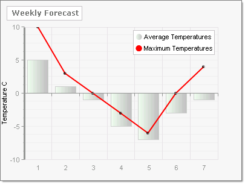
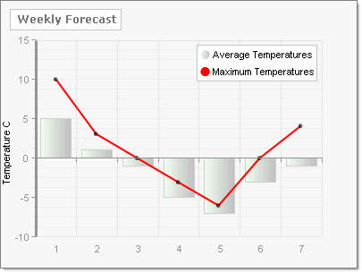

# How to Extend the Displayable Area for YAxis Data

>caution  **RadChart** has been replaced by [RadHtmlChart](http://www.telerik.com/products/aspnet-ajax/html-chart.aspx), Telerik's client-side charting component. If you are considering **RadChart** for new development, examine the [RadHtmlChart documentation]() and [online demos](http://demos.telerik.com/aspnet-ajax/htmlchart/examples/overview/defaultcs.aspx) first to see if it will fit your development needs. If you are already using **RadChart** in your projects, you can migrate to **RadHtmlChart** by following these articles: [Migrating Series](), [Migrating Axes](), [Migrating Date Axes](), [Migrating Databinding](), [Features parity](). Support for **RadChart** is discontinued as of **Q3 2014**, but the control will remain in the assembly so it can still be used. We encourage you to use **RadHtmlChart** for new development.

"My data touches the upper boundary of the plot area but that makes the data harder to see. How do I extend the viewable area along the YAxis?"

Assign the YAxis AxisMode property. By default the ChartYAxisMode property value is **Normal** and the YAxis data fills the available space.

`myChart.PlotArea.YAxis.AxisMode = ChartYAxisMode.Normal;`

If you set the ChartYAxisMode to **Extended**, additional area is placed above the highest data point to make the chart easier to read.

`myChart.PlotArea.YAxis.AxisMode = ChartYAxisMode.Extended;`

