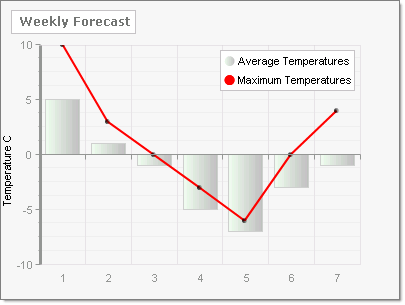
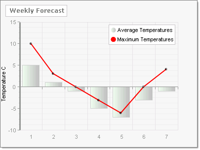

# How to Extend the Displayable Area for YAxis Data

>caution **RadChart** has been deprecated since Q3 2014 and is marked as obsolete as of the 2026 Q2 SP1 (v2026.2.708) release. This is the last release that includes the RadChart component — its source code will be removed from the assembly in the next release. We strongly recommend using [RadHtmlChart](https://www.telerik.com/products/aspnet-ajax/html-chart.aspx), Telerik's modern client-side charting component. 
>To transition from RadChart to RadHtmlChart, refer to the following migration articles:
> - [Migrating Series]()
> - [Migrating Axes]()
> - [Migrating Date Axes]()
> - [Migrating Databinding]()
> - [Features parity]()
>Explore the [RadHtmlChart documentation]() and online demos to determine how it fits your development needs.

"My data touches the upper boundary of the plot area but that makes the data harder to see. How do I extend the viewable area along the YAxis?"

Assign the YAxis AxisMode property. By default the ChartYAxisMode property value is **Normal** and the YAxis data fills the available space.

`myChart.PlotArea.YAxis.AxisMode = ChartYAxisMode.Normal;`

If you set the ChartYAxisMode to **Extended**, additional area is placed above the highest data point to make the chart easier to read.

`myChart.PlotArea.YAxis.AxisMode = ChartYAxisMode.Extended;`

