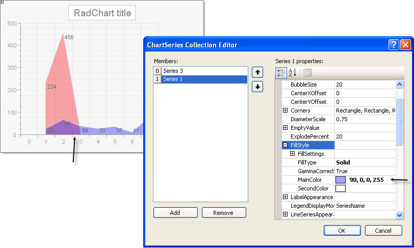

# How to Make Colors Display with Partial Transparency

>caution  **RadChart** has been replaced by [RadHtmlChart](http://www.telerik.com/products/aspnet-ajax/html-chart.aspx), Telerik's client-side charting component.	If you are considering **RadChart** for new development, examine the [RadHtmlChart documentation](ffd58685-7423-4c50-9554-f92c70a75138) and [online demos](http://demos.telerik.com/aspnet-ajax/htmlchart/examples/overview/defaultcs.aspx) first to see if it will fit your development needs.	If you are already using **RadChart** in your projects, you can migrate to **RadHtmlChart** by following these articles:[Migrating Series](2f393f28-bc31-459c-92aa-c3599785f6cc),[Migrating Axes](3f1bea81-87b9-4324-b0d2-d13131031048),[Migrating Date Axes](93226130-bc3c-4c53-862a-f9e17b2eb7dd),[Migrating Databinding](d6c5e2f1-280c-4fb0-b5b0-2f507697511d),[Feature parity](010dc716-ce38-480b-9157-572e0f140169).	Support for **RadChart** is discontinued as of **Q3 2014** , but the control will remain in the assembly so it can still be used.	We encourage you to use **RadHtmlChart** for new development.

"If I have several series that overlap and I want partial transparency so I can see all series at one time (without it being a stacked chart), how do I set a color to be transparent?" 

When defining the color, add an "alpha" channel, i.e. a percentage of transparency to the beginning of the array that defines the color. For example: 

255, 0, 0 = Red

80, 255, 0, 0 = Red that is 80% transparent.

In the example below both series have a main color with a transparency of 90%.

