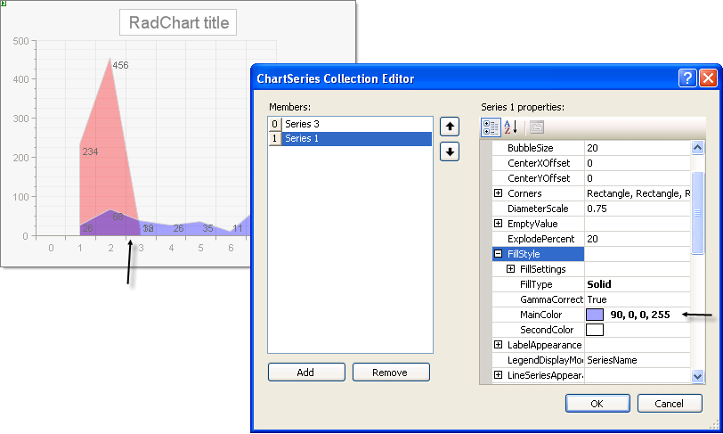

# How to Make Colors Display with Partial Transparency

>caution **RadChart** has been deprecated since Q3 2014 and is marked as obsolete as of the 2026 Q2 SP1 (v2026.2.708) release. This is the last release that includes the RadChart component — its source code will be removed from the assembly in the next release. We strongly recommend using [RadHtmlChart](https://www.telerik.com/products/aspnet-ajax/html-chart.aspx), Telerik's modern client-side charting component. 
>To transition from RadChart to RadHtmlChart, refer to the following migration articles:
> - [Migrating Series]()
> - [Migrating Axes]()
> - [Migrating Date Axes]()
> - [Migrating Databinding]()
> - [Features parity]()
>Explore the [RadHtmlChart documentation]() and online demos to determine how it fits your development needs.

"If I have several series that overlap and I want partial transparency so I can see all series at one time (without it being a stacked chart), how do I set a color to be transparent?" 

When defining the color, add an "alpha" channel, i.e. a percentage of transparency to the beginning of the array that defines the color. For example: 

255, 0, 0 = Red

80, 255, 0, 0 = Red that is 80% transparent.

In the example below both series have a main color with a transparency of 90%.

