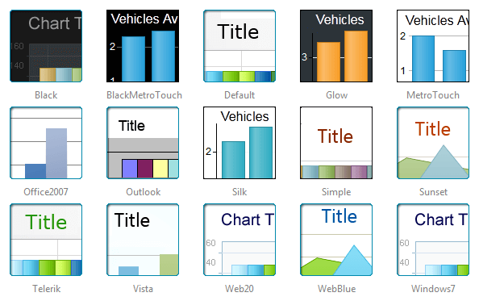

# Chart Skin

>caution  **RadChart** has been replaced by [RadHtmlChart](https://www.telerik.com/products/aspnet-ajax/html-chart.aspx), Telerik's client-side charting component. If you are considering **RadChart** for new development, examine the [RadHtmlChart documentation]() and [online demos](https://demos.telerik.com/aspnet-ajax/htmlchart/examples/overview/defaultcs.aspx) first to see if it will fit your development needs. If you are already using **RadChart** in your projects, you can migrate to **RadHtmlChart** by following these articles: [Migrating Series](), [Migrating Axes](), [Migrating Date Axes](), [Migrating Databinding](), [Features parity](). Support for **RadChart** is discontinued as of **Q3 2014**, but the control will remain in the assembly so it can still be used. We encourage you to use **RadHtmlChart** for new development.

The skins in RadChart are a set of predefined appearance properties. You can use the embedded skins by setting the RadChart. Skin property to a name of a skin. You can also set the property to **Custom** and use your own appearance settings.

>note Since Q1 2013 three new skins have been added for RadChart(BlackMetroTouch, Glow and Silk).

## Saving own skins

You can either start from existing skin and modify its properties or start from scratch. We recommend the first approach as easier to use.

Once you have set up your skin you can save it in a **ChartSkin** object using the **CreateFromChart** method. Then you can save this object to an XML file (which will be your skin).

When you want to reuse the skin, you need to create an instance of **ChartSkin** object, specifying the XML file as a source. Then you can apply the skin to the chart using the **ApplyTo** method.

````C#
//Save the XML Skin file...
 ChartSkin myCustomSkin = new ChartSkin();
 myCustomSkin.CreateFromChart(RadChart1.Chart, "CustomSkin");
//Restore the XML Skin file...
 ChartSkin myCustomSkin1 = new ChartSkin(xmlSource);
 myCustomSkin1.ApplyTo(RadChart1.Chart); 
````
````VB	
'Save the XML Skin file...
Dim myCustomSkin As New ChartSkin()
myCustomSkin.CreateFromChart(RadChart1.Chart, "CustomSkin")
'Restore the XML Skin file...
Dim myCustomSkin1 As New ChartSkin(xmlSource)
myCustomSkin1.ApplyTo(RadChart1.Chart) 
````


