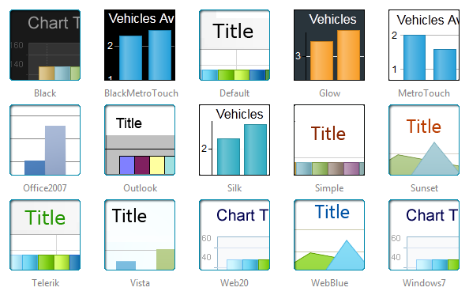

# Chart Skin


>caution  __RadChart__ has been replaced by[RadHtmlChart](http://www.telerik.com/products/aspnet-ajax/html-chart.aspx), Telerik's client-side charting component.	If you are considering __RadChart__ for new development, examine the[RadHtmlChart documentation](ffd58685-7423-4c50-9554-f92c70a75138)and[online demos](http://demos.telerik.com/aspnet-ajax/htmlchart/examples/overview/defaultcs.aspx)first to see if it will fit your development needs.	If you are already using __RadChart__ in your projects, you can migrate to __RadHtmlChart__ by following these articles:[Migrating Series](2f393f28-bc31-459c-92aa-c3599785f6cc),[Migrating Axes](3f1bea81-87b9-4324-b0d2-d13131031048),[Migrating Date Axes](93226130-bc3c-4c53-862a-f9e17b2eb7dd),[Migrating Databinding](d6c5e2f1-280c-4fb0-b5b0-2f507697511d),[Feature parity](010dc716-ce38-480b-9157-572e0f140169).	Support for __RadChart__ is discontinued as of __Q3 2014__ , but the control will remain in the assembly so it can still be used.	We encourage you to use __RadHtmlChart__ for new development.
>


The skins in RadChart are a set of predefined appearance properties. You can use the embedded skins by setting the RadChart. Skin property to a name of a skin. You can also set the property to __Custom__ and use your own appearance settings.

>note Since Q1 2013 three new skins have been added for RadChart(BlackMetroTouch, Glow and Silk).
>


## Saving own skins

You can either start from existing skin and modify its properties or start from scratch. We recommend the first approach as easier to use.

Once you have set up your skin you can save it in a __ChartSkin__ object using the __CreateFromChart__ method. Then you can save this object to an XML file (which will be your skin).

When you want to reuse the skin, you need to create an instance of __ChartSkin__ object, specifying the XML file as a source. Then you can apply the skin to the chart using the __ApplyTo__ method.

>tabbedCode

````C#
	
	    //Save the XML Skin file...
	     ChartSkin myCustomSkin = new ChartSkin();
	     myCustomSkin.CreateFromChart(RadChart1.Chart, "CustomSkin");
	    //Restore the XML Skin file...
	     ChartSkin myCustomSkin1 = new ChartSkin(xmlSource);
	     myCustomSkin1.ApplyTo(RadChart1.Chart); 
	
````


````VB.NET
	
	    'Save the XML Skin file...
	    Dim myCustomSkin As New ChartSkin()
	    myCustomSkin.CreateFromChart(RadChart1.Chart, "CustomSkin")
	    'Restore the XML Skin file...
	    Dim myCustomSkin1 As New ChartSkin(xmlSource)
	    myCustomSkin1.ApplyTo(RadChart1.Chart) 
	
````


>end


