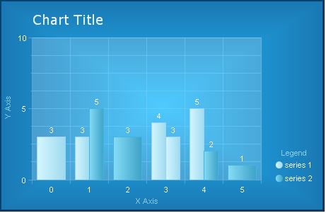

# Step-By-Step Skinning Example

>caution  **RadChart** has been replaced by [RadHtmlChart](https://www.telerik.com/products/aspnet-ajax/html-chart.aspx), Telerik's client-side charting component. If you are considering **RadChart** for new development, examine the [RadHtmlChart documentation]() and [online demos](https://demos.telerik.com/aspnet-ajax/htmlchart/examples/overview/defaultcs.aspx) first to see if it will fit your development needs. If you are already using **RadChart** in your projects, you can migrate to **RadHtmlChart** by following these articles: [Migrating Series](), [Migrating Axes](), [Migrating Date Axes](), [Migrating Databinding](), [Features parity](). Support for **RadChart** is discontinued as of **Q3 2014**, but the control will remain in the assembly so it can still be used. We encourage you to use **RadHtmlChart** for new development.

Here is a list of the steps one has to make in order to style RadChart to look like the image we used when describing the [Chart elements](). We start with a plain chart with no visual properties defined.

1. Styling the chart’s borders and background

1. Appearance -> Appearance -> Border -> Color : **0; 66; 110**

1. Appearance -> Appearance -> Border -> Width : **5**

1. Appearance -> Appearance -> FillStyle -> FillType : **Gradient**

1. Appearance -> Appearance -> FillStyle -> FillSettings -> GradientMode : **Center**

1. Appearance -> Appearance -> FillStyle -> MainColor : **35; 189; 254**

1. Appearance -> Appearance -> FillStyle -> SecondColor : **26; 120; 179**

1. 

1. Styling the title

1. Elements -> ChartTitle -> Appearance -> Border -> Visible : **False**

1. Elements -> ChartTitle -> Appearance -> FillStyle -> MainColor : **None / Transparent**

1. Elements -> ChartTitle -> TextBlock -> Appearance -> TextProperties -> Color : **White**

1. Elements -> ChartTitle -> TextBlock -> Appearance -> TextProperties -> Font : **Verdana; 14pt**

1. Elements -> ChartTitle -> Appearance ->Position -> AlignedPosition : **TopLeft**

1. Elements -> ChartTitle -> Appearance -> Dimensions -> Margins : **4%; 10px; 14px; 8%**

1. Styling the legend

1. Elements -> Legend -> Appearance -> FillStyle -> MainColor : **None / Transparent**

1. Elements -> Legend -> Appearance -> Border -> Visible : **False**

1. Elements -> Legend -> Appearance -> ItemTextAppearance -> TextProperties -> Color : **White**

1. Elements -> Legend -> TextBlock -> Text : **Legend**

1. Elements -> Legend -> TextBlock -> Visible : **True**

1. Elements -> Legend -> TextBlock -> Appearance -> TextProperties -> Color : **LightSkyBlue**

1. Elements -> Legend -> TextBlock -> Appearance -> Position -> AlignedPosition : **Top**

1. Elements -> Legend -> Appearance -> Position -> AlignedPosition -> **BottomRight**

1. Elements -> Legend -> Appearance -> Dimensions -> Margins : **1px; 3%; 12%; 1px**

1. Styling the plotarea

1. Elements -> PlotArea -> Appearance -> Border -> Color : **97; 180; 223**

1. Elements -> PlotArea -> Appearance -> FillStyle -> MainColor : **50; 255; 255; 255**

1. Elements -> PlotArea -> Appearance -> Dimensions -> Margins : **18%; 90px; 15%; 10%**

1. Styling the X Axis

1. Elements -> PlotArea -> XAxis -> Appearance -> Color : **96; 164; 205**

1. Elements -> PlotArea -> XAxis -> Appearance -> MajorGridLines -> Color : **120; 209; 248**

1. Elements -> PlotArea -> XAxis -> Appearance -> MajorTick -> Color : **96; 164; 205**

1. Elements -> PlotArea -> XAxis -> Appearance -> TextAppearance -> TextProperties -> Color : **White**

1. Elements -> PlotArea -> XAxis -> AxisLabel -> TextBlock -> Text -> **X Axis**

1. Elements -> PlotArea -> XAxis -> AxisLabel -> TextBlock -> Appearance -> TextProperties -> Color : **LightSkyBlue**

1. Elements -> PlotArea -> XAxis -> AxisLabel -> Appearance -> Dimensions -> Paddings : **1px; 1px; 10%; 1px**

1. Styling the Y Axis

1. Elements -> PlotArea -> YAxis -> Appearance -> Color : **95; 165; 208**

1. Elements -> PlotArea -> YAxis -> Appearance -> MajorGridLines -> Color : **120; 209; 248**

1. Elements -> PlotArea -> YAxis -> Appearance -> MajorTick -> Color : **95; 165; 208**

1. Elements -> PlotArea -> YAxis -> Appearance -> MajorGridLines -> Color : **120; 209; 248**

1. Elements -> PlotArea -> YAxis -> Appearance -> MinorTick -> Color : **95; 165; 208**

1. Elements -> PlotArea -> YAxis -> Appearance -> TextAppearance -> TextProperties -> Color : **White**

1. Elements -> PlotArea -> YAxis -> AxisLabel -> TextBlock -> Text -> **Y Axis**

1. Elements -> PlotArea -> YAxis -> AxisLabel -> TextBlock -> Appearance -> TextProperties -> Color : **LightSkyBlue**

1. Styling the data series

1. Data -> Series -> Series 1 -> Appearance -> Appearance -> Border -> Color : **153; 209; 248**

1. Data -> Series -> Series 1 -> Appearance -> Appearance -> FillStyle -> MainColor : **213; 247; 255**

1. Data -> Series -> Series 1 -> Appearance -> Appearance -> FillStyle -> SecondColor : **157; 217; 238**

1. Data -> Series -> Series 1 -> Appearance -> Appearance -> TextAppearance -> TextProperties -> Color : **White**

1. Data -> Series -> Series 2 -> Appearance -> Appearance -> Border -> Color : **67; 181; 229**

1. Data -> Series -> Series 2 -> Appearance -> Appearance -> FillStyle -> MainColor : **136; 221; 246**

1. Data -> Series -> Series 2 -> Appearance -> Appearance -> FillStyle -> SecondColor : **59; 161; 197**

1. Data -> Series -> Series 2 -> Appearance -> Appearance -> TextAppearance -> TextProperties -> Color : **White**

