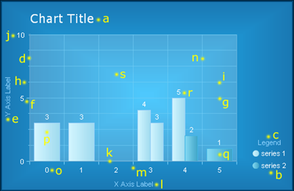

# Styling Chart Elements

>caution  **RadChart** has been replaced by [RadHtmlChart](https://www.telerik.com/products/aspnet-ajax/html-chart.aspx), Telerik's client-side charting component. If you are considering **RadChart** for new development, examine the [RadHtmlChart documentation]() and [online demos](https://demos.telerik.com/aspnet-ajax/htmlchart/examples/overview/defaultcs.aspx) first to see if it will fit your development needs. If you are already using **RadChart** in your projects, you can migrate to **RadHtmlChart** by following these articles: [Migrating Series](), [Migrating Axes](), [Migrating Date Axes](), [Migrating Databinding](), [Features parity](). Support for **RadChart** is discontinued as of **Q3 2014**, but the control will remain in the assembly so it can still be used. We encourage you to use **RadHtmlChart** for new development.

RadChart offers a set of properties to modify the look and feel of its elements. See those elements marked on the image below consider the table showing where their customization properties are located in the chart properties grid.

| Element | Properties |
| ------ | ------ |
|a. Chart Title|  Elements -> ChartTitle -> Appearance; Elements -> ChartTitle -> TextBlock|
|b. Legend|Elements -> Legend -> Appearance|
|c. Legend TextBlock (Legend Title)|Elements -> Legend -> TextBlock|
|d. Y Axis| PlotArea -> YAxis -> Appearance|
|e. Y Axis Label (Axis Title)|PlotArea -> YAxis -> AxisLabel|
|f. Y Axis Major Tick|PlotArea -> YAxis -> Appearance -> MajorTick|
|g. Y Axis Major GridLine|PlotArea -> YAxis -> Appearance -> MajorGridLines|
|h. Y Axis Minor Tick| PlotArea -> YAxis -> Appearance -> MinorTicк|
|i. Y Axis Minor GridLine| PlotArea -> YAxis -> Appearance -> MinorGridLines|
|j. Y Axis Label (Digit)|PlotArea -> YAxis -> Appearance -> LabelAppearance|
|k. X Axis| PlotArea -> XAxis -> Appearance|
|l. X Axis Label (Axis Title)|PlotArea -> XAxis -> AxisLabel|
|m. X Axis Major Tick| PlotArea -> XAxis -> Appearance -> MajorTick|
|n. X Axis Major GridLine| PlotArea -> XAxis -> Appearance -> MajorGridLines|
|o. X Axis Label (Digit)|PlotArea -> XAxis -> Appearance -> LabelAppearance|
|p. Series 1| Data -> Series -> [series name] -> Appearance -> Appearance|
|q. Series 2|Data -> Series -> [series name] -> Appearance -> Appearance|
|r. Series Item Label| Data -> Series -> [series name] -> Appearance -> Appearance -> TextAppearance|
|s. PlotArea|Elements -> PlotArea -> Appearance|

## Common Appearance Properties

All chart elements have common appearance settings, which are:

* **Border** – border width, color and style

* **Corners** – corner style and size

* **Dimensions** – width, height, margin, padding

* **FillStyle** – background color, image and gradients

* **Position**

* **Shadow** – color, distance and position

* **Visible** – true or false

