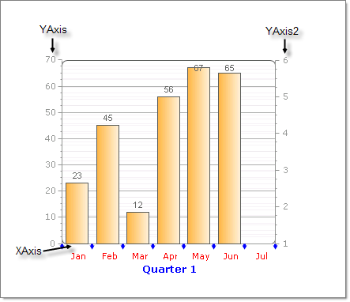
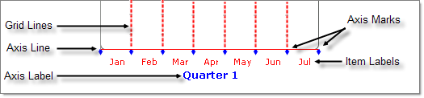

# Axes

>caution  **RadChart** has been replaced by [RadHtmlChart](https://www.telerik.com/products/aspnet-ajax/html-chart.aspx), Telerik's client-side charting component. If you are considering **RadChart** for new development, examine the [RadHtmlChart documentation]() and [online demos](https://demos.telerik.com/aspnet-ajax/htmlchart/examples/overview/defaultcs.aspx) first to see if it will fit your development needs. If you are already using **RadChart** in your projects, you can migrate to **RadHtmlChart** by following these articles: [Migrating Series](), [Migrating Axes](), [Migrating Date Axes](), [Migrating Databinding](), [Features parity](). Support for **RadChart** is discontinued as of **Q3 2014**, but the control will remain in the assembly so it can still be used. We encourage you to use **RadHtmlChart** for new development.

X and Y axes are included in all chart types but the [Pie]() chart. Typically the YAxis displays values and the XAxis displays categories.For example, the YAxis might show "items sold" or "revenue", while the XAxis might show "Months" or "Products". The X axis can also display values. A second "Y" axis property YAxis2 is provided for displaying a second scale of measurements.

## Axis Elements

Each axis has:

* Grid lines display perpendicular to the axis covering the plot area.

* Axis line

* Axis label

* Axis marks along the axis line

* Item labels below the axis line

The example below shows a sample X-axis with several appearance related properties customized.

The RadChart PlotArea property has sub properties XAxis, YAxis and YAxis2. Each axis object has an Appearance property used to make the customizations shown above.Some significant axis appearance related properties are:

* The LabelAppearance property includes sub properties that control the axis label **visibility**, **Border**, **Corners**, **Dimensions**, **FillStyle**, **Position** and **Shadow**.

* MajorGridlines controls the appearance of grid lines displaying over the plot area including **visibility**, **Cap**, **Color**, **PenStyle** and **Width**.

* TextAppearance handles the axis item label text, most notably TextAppearance.TextProperties controls font properties and color.

>note Axis properties can be set from the Properties Window of Visual Studio, in the XML configuration file, or through the API. Properties for the X and Y axis are identical except where noted.

## Formatting Axis

You can modify the overall appearance of an axes by changing the AutoScale and AutoShrink properties.These properties when set to true cause the axis to expand and shrink to accommodate dynamically added and removed items. This is useful when the number of items changes on-the-fly.

>tip Turn AutoScale off if you want complete control over labeling of an axis.

## Formatting Axis Labels

To display a range of values along an axis, specify for the ChartAxis a starting MinValue, an ending MaxValue, and a Step. In the example above, the YAxis has a MinValue of "0", a MaxValue of "250" and a Step of "50." The X axis is labeled explicitly by setting PlotArea.XAxis properties:

* AutoScale = False

* MaxValue = 3

* MinValue = 1

* Step = 1

* Visible = True

* Items is populated with with 3 ChartAxisItem objects where the Appearance.Text property contains "Non-Smokers", "Social Smokers" and "Heavy Smokers".

You can control the size and position of the labels using the axis **Appearance.LabelAppearance Dimensions** and **Position** properties.

## Unique YAxis and YAxis2 Properties

AxisMode: AxisMode can be **Normal** (the default) or **Extended**. **Extended** mode provides buffer space above the largest value for best visual formatting.

ScaleBreaks: The ScaleBreaks feature allows you to "break off" large chunks of the axis so that graphs with large amplitude are easier to read. ScaleBreaks are available for both YAxis and YAxis2 of the plot area. By default **Enabled** is false so scale breaks do not display. Set the maximum number of breaks using **MaxBreaks** and **MinCollapsibleSpace** to set the minimum interval between data points before a break will occur. For the lines that make up each break, **Spacing** controls the amount of space between lines and **LineType** controls the shape of the line (i.e. **Sinusoid**, **Straight**, **JaggedCurve** and **Curve**).

