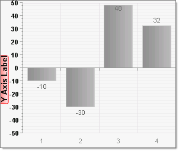
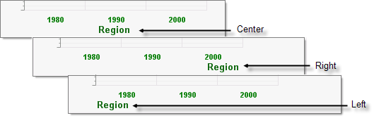
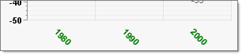
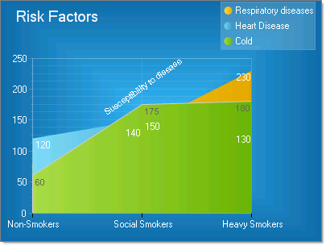

# Axis Labels

>caution  **RadChart** has been replaced by[RadHtmlChart](http://www.telerik.com/products/aspnet-ajax/html-chart.aspx), Telerik's client-side charting component.	If you are considering **RadChart** for new development, examine the[RadHtmlChart documentation](ffd58685-7423-4c50-9554-f92c70a75138)and[online demos](http://demos.telerik.com/aspnet-ajax/htmlchart/examples/overview/defaultcs.aspx)first to see if it will fit your development needs.	If you are already using **RadChart** in your projects, you can migrate to **RadHtmlChart** by following these articles:[Migrating Series](2f393f28-bc31-459c-92aa-c3599785f6cc),[Migrating Axes](3f1bea81-87b9-4324-b0d2-d13131031048),[Migrating Date Axes](93226130-bc3c-4c53-862a-f9e17b2eb7dd),[Migrating Databinding](d6c5e2f1-280c-4fb0-b5b0-2f507697511d),[Feature parity](010dc716-ce38-480b-9157-572e0f140169).	Support for **RadChart** is discontinued as of **Q3 2014** , but the control will remain in the assembly so it can still be used.	We encourage you to use **RadHtmlChart** for new development.

Labels are displayed for each:

* *Chart axis* to describe the category of values along the axis. For example "Products", "Risk Factors", time periods or geographic areas.

* *Chart axis item* to describe the specific value or category for that item.

## Formatting Axis Labels

* To format the *chart axis label* use the PlotArea.<axis>.AxisLabel to access **Appearance** and **TextBlock** properties

* To set the formatting for *all labels* on an axis use the PlotArea.<axis>.Appearance LabelAppearance and TextAppearance properties.

* To format a label for a *specific chart axis item* use the PlotArea.<axis>.Items[].Appearance property.

Use the **MinValue** and **MaxValue** properties to specify the minimum and maximum values for the data to display. The **MinValue** property allows you to specify either negative or positive number as the minimum value. In the example below the **MinValue**= -50, **MaxValue**= 50 and **Step** = 10.

The PlotArea..Appearance.ValueFormat property automatically formats axis label values as **Currency**, **Scientific**, **General**, **Number**, **Percent**, **ShortDate**, **ShortTime**, **LongDate**, **LongTime** or **None**.

## Positioning Axis Labels

You can specify the horizontal and vertical alignment of axis labels and axis item labels using the **Appearance.Position** property of the axis label or chart axis item respectively. **Position** has sub properties for AlignedPosition, Auto, X and Y.

Use AlignedPosition to automatically place the label **Right**, **Left**, **Top**, **Center**, **TopRight**, **TopLeft**, **BottomRight** or **BottomLeft**.

Use the RotationAngle property to spin axis and axis item labels to any angle.In the example below the XAxis.Appearance.LabelAppearance.RotationAngle is set to 45.

By turning off the Position.Auto property and setting Position.AlignedPosition to **None** you can place the axis label any where in the plot area. In the example below the **PlotArea.YAxis.AxisLabel.Appearance.Position** property is configured such that:

* AlignedPosition =None

* Auto = False

* X = 120

* Y = 200

The **YAxis.AxisLabel.Appearance.RotationAngle** = 325.

>note This isn't a recommended or usual approach but serves to illustrate the flexibility of the object model.

Also in the example below, the **PlotArea.XAxis.AutoScale** is turned off so the **PlotArea.XAxis.Items** collection could be populated manually.Each ChartAxisItem has its TextBlock.Text property populated with the strings "Non-Smokers", "Social Smokers" and "Heavy Smokers".

