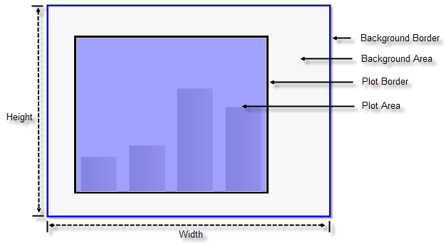

# Background and Plot Areas

>caution  **RadChart** has been replaced by [RadHtmlChart](https://www.telerik.com/products/aspnet-ajax/html-chart.aspx), Telerik's client-side charting component. If you are considering **RadChart** for new development, examine the [RadHtmlChart documentation]() and [online demos](https://demos.telerik.com/aspnet-ajax/htmlchart/examples/overview/defaultcs.aspx) first to see if it will fit your development needs. If you are already using **RadChart** in your projects, you can migrate to **RadHtmlChart** by following these articles: [Migrating Series](), [Migrating Axes](), [Migrating Date Axes](), [Migrating Databinding](), [Features parity](). Support for **RadChart** is discontinued as of **Q3 2014**, but the control will remain in the assembly so it can still be used. We encourage you to use **RadHtmlChart** for new development.

## Chart Background

The background of the chart is the outermost rectangle that encloses all other elements of the chart. It stretches for the whole width and length of the output image of the chart. Using the Appearance property of the chart you can fully customize the chart background look and feel including:

* Border visibility, color, pen style and width.

* The Corners property lets you square or round each corner individually. The degree of rounding can be tailored.

* FillStyle controls the fill color and type (solid, hatched, image, gradient).

* ImageQuality and TextQuality properties can also be fine tuned.

## Plot Area

The plot area is the working rectangular area between X and Y axes where data is displayed. The size of the plot depends on the chart background size and the chart margins, which define the distance between the border of the plot area and the border of the chart background. This area is represented by the RadChart PlotArea property. Some unique PlotArea properties are:

* SeriesOrientation is an enumeration that orients the entire PlotArea either Vertical or Horizontal.

* XAxis, YAxis, and YAxis2 properties. These axis properties control the scale and appearance of both axes. See the [Axes]() topic for more information.

* [DataTable](): Displays a spreadsheet style table of the data in the chart, typically just below the chart itself. See the [DataTable]() topic for more information.

* EmptySeriesMessage: The predefined message that displays in the PlotArea when there is no series data defined for the chart.

* [MarkedZones](): Areas in the background of the chart that can be defined, labeled and filled. [MarkedZones]() are used to highlight or group areas on the chart.

Like the RadChart as a whole, PlotArea has an Appearance property allowing customization:

* Border visibility, color, pen style and width.

* The Corners property lets you square or round each corner individually. The degree of rounding can be tailored.

* FillStyle controls the fill color and type (solid, hatched, image, gradient).

* The Dimensions property provides control of **Width**, **Height**, **Margins**, **Paddings** and if you want the dimensions to **Autosize**.

* SeriesPalette is a property of the chart that lets you to choose a predefined skin color palette for each series.This can help provide a distinct look to differentiate each series.

* The **Shadow** property lets you control shadow Blur, shadow Color, shadow Distance and Position relative to the plot area.
