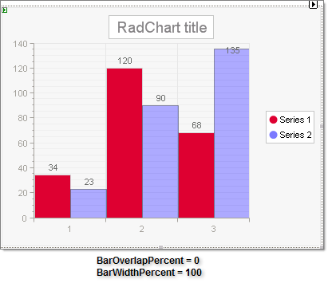
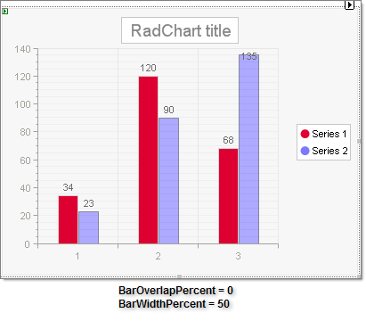
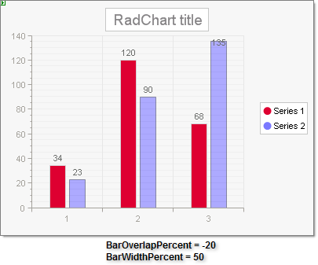
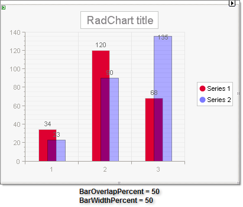

# BarOverLapPercent and BarWidthPercent

>caution  **RadChart** has been replaced by [RadHtmlChart](http://www.telerik.com/products/aspnet-ajax/html-chart.aspx), Telerik's client-side charting component. If you are considering **RadChart** for new development, examine the [RadHtmlChart documentation]() and [online demos](http://demos.telerik.com/aspnet-ajax/htmlchart/examples/overview/defaultcs.aspx) first to see if it will fit your development needs. If you are already using **RadChart** in your projects, you can migrate to **RadHtmlChart** by following these articles: [Migrating Series](), [Migrating Axes](), [Migrating Date Axes](), [Migrating Databinding](), [Features parity](). Support for **RadChart** is discontinued as of **Q3 2014**, but the control will remain in the assembly so it can still be used. We encourage you to use **RadHtmlChart** for new development.

In bar charts with multiple series BarOverLapPercent governs to what degree the bars will overlap the preceding bar series. If you enter a negative value for **BarOverLapPercent**, a gap appears between the bars of different series. Overlapping is especially useful when a long series of items needs to fit in a small-size chart.

BarWidthPercent controls how much space each bar takes up so that a BarWidthPercent of 100 will have all the bars in the chart taking exactly all the available width.

>note The maximum bar width is calculated as follows: *bar width* = *axislength* / *bars*  *count* .

See the examples below to see how these two properties work together.

