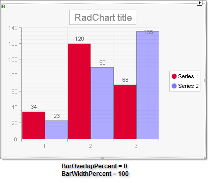
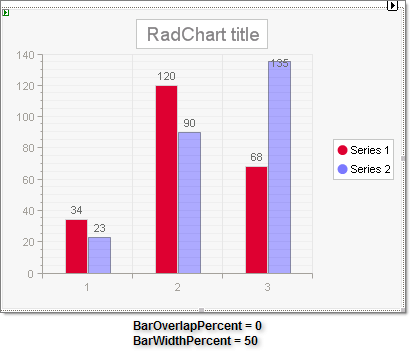
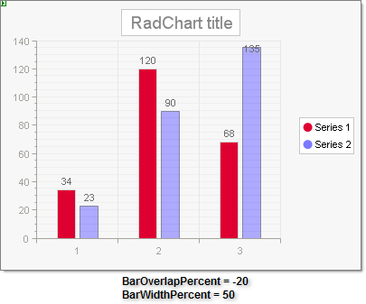
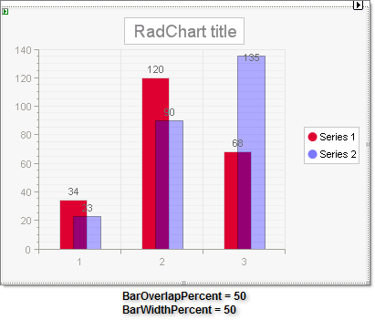

# BarOverLapPercent and BarWidthPercent

>caution **RadChart** has been deprecated since Q3 2014 and is marked as obsolete as of the 2026 Q2 SP1 (v2026.2.708) release. This is the last release that includes the RadChart component — its source code will be removed from the assembly in the next release. We strongly recommend using [RadHtmlChart](https://www.telerik.com/products/aspnet-ajax/html-chart.aspx), Telerik's modern client-side charting component. 
>To transition from RadChart to RadHtmlChart, refer to the following migration articles:
> - [Migrating Series]()
> - [Migrating Axes]()
> - [Migrating Date Axes]()
> - [Migrating Databinding]()
> - [Features parity]()
>Explore the [RadHtmlChart documentation]() and online demos to determine how it fits your development needs.

In bar charts with multiple series BarOverLapPercent governs to what degree the bars will overlap the preceding bar series. If you enter a negative value for **BarOverLapPercent**, a gap appears between the bars of different series. Overlapping is especially useful when a long series of items needs to fit in a small-size chart.

BarWidthPercent controls how much space each bar takes up so that a BarWidthPercent of 100 will have all the bars in the chart taking exactly all the available width.

>note The maximum bar width is calculated as follows: *bar width* = *axislength* / *bars*  *count* .

See the examples below to see how these two properties work together.

