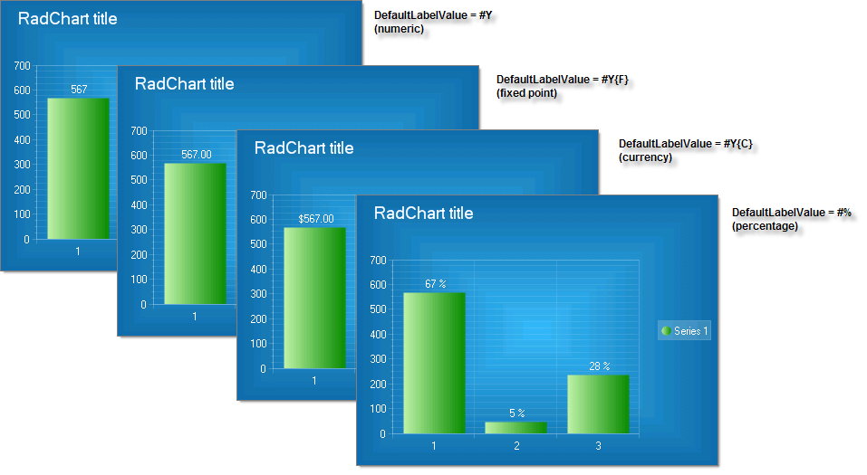

# DefaultLabelValue

>caution **RadChart** has been deprecated since Q3 2014 and is marked as obsolete as of the 2026 Q2 SP1 (v2026.2.708) release. This is the last release that includes the RadChart component — its source code will be removed from the assembly in the next release. We strongly recommend using [RadHtmlChart](https://www.telerik.com/products/aspnet-ajax/html-chart.aspx), Telerik's modern client-side charting component. 
>To transition from RadChart to RadHtmlChart, refer to the following migration articles:
> - [Migrating Series]()
> - [Migrating Axes]()
> - [Migrating Date Axes]()
> - [Migrating Databinding]()
> - [Features parity]()
>Explore the [RadHtmlChart documentation]() and online demos to determine how it fits your development needs.

DefaultLabelValue specifies a format for label values that will be displayed automatically if you do not specifically assign text to a chart series item.

* Use "#Y" or "#X" to display numbers from the X or Y axis respectively

* Use "#%" for a percentage of the total sum (of all items).

* Use "#SUM" to display the total of all items.

* "#STSUM" displays the sum of a stacked series.

* "#SERIES" displays the series name.

* "#ITEM" displays the item name.

* You can also use the formatting described in this MSDN article [Standard Numeric Format Strings](https://msdn2.microsoft.com/en-us/library/dwhawy9k.aspx). Use curly brackets to contain the standard numeric formats. For example, you can display Y values as currency by setting DefaultLabelValue to "#Y{C}". See examples in the figure below.

