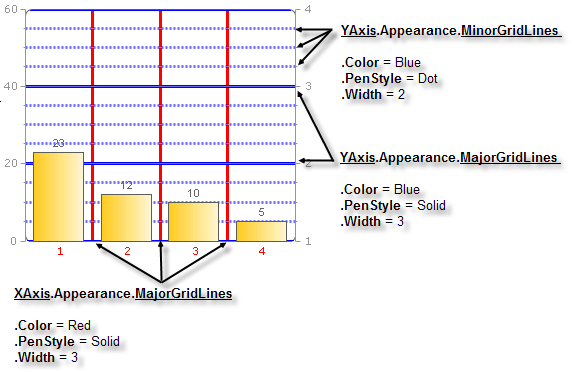

# Gridlines

>caution  **RadChart** has been replaced by[RadHtmlChart](http://www.telerik.com/products/aspnet-ajax/html-chart.aspx), Telerik's client-side charting component.	If you are considering **RadChart** for new development, examine the[RadHtmlChart documentation](ffd58685-7423-4c50-9554-f92c70a75138)and[online demos](http://demos.telerik.com/aspnet-ajax/htmlchart/examples/overview/defaultcs.aspx)first to see if it will fit your development needs.	If you are already using **RadChart** in your projects, you can migrate to **RadHtmlChart** by following these articles:[Migrating Series](2f393f28-bc31-459c-92aa-c3599785f6cc),[Migrating Axes](3f1bea81-87b9-4324-b0d2-d13131031048),[Migrating Date Axes](93226130-bc3c-4c53-862a-f9e17b2eb7dd),[Migrating Databinding](d6c5e2f1-280c-4fb0-b5b0-2f507697511d),[Feature parity](010dc716-ce38-480b-9157-572e0f140169).	Support for **RadChart** is discontinued as of **Q3 2014** , but the control will remain in the assembly so it can still be used.	We encourage you to use **RadHtmlChart** for new development.

Gridlines are auxiliary lines that form a grid for easier reading of the chart. Gridlines can be vertical or horizontal. Vertical gridlines are controlled by the XAxis and horizontal gridlines are controlled by YAxis and YAxis2. Gridlines can be "major", e.g. falling on the labeled axis Step values."Minor" gridlines appear for YAxisand YAxis2 that fall between Step values. See the figure below where major gridlines fall on 20 and 40 of the YAxis and minor gridlines fall between the major gridlines.

To control the visibility and general appearance of gridlines use the the PlotArea.<axis>.Appearance property to reach MajorGridLines and MinorGridlines properties.XAxis has only MajorGridLines while YAxis have both MajorGridLines and MinorGridlines properties.Both major and minor gridline objects include the following properties:

* **Visible**

* **Color**

* **PenStyle** (Solid, Dash, Dot, DashDot, DashDotDot and Custom)

* **Width**

In the example below both X axis and Y axis are visible.XAxis MajorGridLines are red solid lines 3 pixels wide. YAxisMinorGridlines are shown as blue dotted lines 2 pixels wide and YAxisMajorGridLines are shown as blue solid lines 3 pixels wide.

